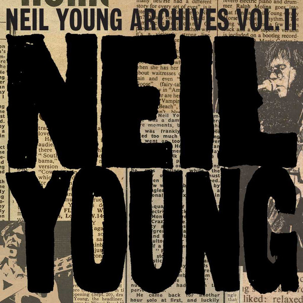

# Neil Young Archives Vol. II (1972 - 1976)

By Neil Young

## Album Data

- Catalog #: Roon
- Format: Digital, Album

## Track listing

1. Letter From 'Nam
2. Monday Morning
3. The Bridge
4. Time Fades Away [12/15/72]
5. Come Along and Say You Will
6. Goodbye Christians on the Shore
7. The Last Trip to Tulsa
8. The Loner
9. Sweet Joni
10. Yonder Stands the Sinner
11. L.A. (Story)
12. LA.
13. Human Highway [6/29/73]
14. Here We Are in the Years [Live From Tuscaloosa]
15. After the Gold Rush [Live From Tuscaloosa]
16. Out on the Weekend [Live From Tuscaloosa]
17. Harvest [Live From Tuscaloosa]
18. Old Man [Live From Tuscaloosa]
19. Heart of Gold [Live From Tuscaloosa]
20. Time Fades Away [Live From Tuscaloosa]
21. Lookout Joe [Live From Tuscaloosa]
22. New Mama [Live From Tuscaloosa]
23. Alabama [Live From Tuscaloosa]
24. Don't Be Denied [Live From Tuscaloosa]
25. Speakin' Out Jam
26. Everybody's Alone
27. Tired Eyes
28. Tonight's the Night
29. Mellow My Mind
30. World on a String
31. Speakin' Out
32. Raised on Robbery
33. Roll Another Number (For the Road)
34. New Mama
35. Albuquerque
36. Tonight's the Night, Pt. II
37. Intro [Live From The Roxy]
38. Tonight's the Night [Live From the Roxy]
39. Roll Out the Barrel [Live From the Roxy]
40. Mellow My Mind [Live From the Roxy]
41. World on a String [Live From the Roxy]
42. Band (Intro) [Live From the Roxy]
43. Speakin' Out [Live From the Roxy]
44. Candy Barr Rap [Live From the Roxy]
45. Albuquerque [Live From the Roxy]
46. Perry Como Rap [Live From the Roxy]
47. New Mama [Live From the Roxy]
48. David Geffen Rap [Live From the Roxy]
49. Roll Another Number (For the Road) [Live From the Roxy]
50. Candy Barr 2 Rap [Live From the Roxy]
51. Tired Eyes [Live From the Roxy]
52. Tonight's the Night, Pt. II [Live From the Roxy]
53. Walk On [Live From the Roxy]
54. The Losing End [Live From the Roxy]
55. Outro [Live From the Roxy]
56. Winterlong
57. Walk On
58. Bad Fog of Loneliness
59. Borrowed Tune
60. Traces [12/5/73]
61. For the Turnstiles
62. Ambulance Blues
63. Motion Pictures (For Carrie)
64. On the Beach
65. Revolution Blues
66. Vampire Blues
67. Greensleeves
68. Love/Art Blues [6/15/74]
69. Through My Sails
70. Homefires
71. Pardon My Heart [6/16/74]
72. Hawaiian Sunrise
73. L.A. Girls and Ocean Boys
74. Pushed It Over the End
75. On the Beach [8/28/74]
76. Vacancy [11/4/74]
77. One More Sign
78. Frozen Man
79. Give Me Strength
80. Bad News Comes to Town
81. Changing Highways
82. Love/Art Blues [12/10/74]
83. The Old Homestead
84. Daughters
85. Deep Forbidden Lake
86. Love/Art Blues [12/31/74]
87. Separate Ways
88. Try
89. Mexico
90. Love Is a Rose
91. Homegrown
92. Florida
93. Kansas [6/12/75]
94. We Don't Smoke It No More
95. White Line
96. Vacancy
97. Little Wing
98. Star of Bethlehem
99. Ride My Llama
100. Cortez the Killer
101. Don't Cry No Tears
102. Born to Run
103. Barstool Blues
104. Danger Bird
105. Stupid Girl
106. Kansas
107. Powderfinger
108. Hawaii
109. Drive Back
110. Lookin' for a Love
111. Pardon My Heart
112. Too Far Gone
113. Pocahontas
114. No One Seems to Know
115. Like a Hurricane
116. Lotta Love
117. Look Out for My Love
118. Separate Ways [2/3/76]
119. Let It Shine
120. Long May You Run
121. Fontainebleau
122. Traces [2/8/76]
123. Mellow My Mind [Live-3/5/76]
124. Midnight on the Bay [Live-3/30/76]
125. Stringman
126. Mediterranean
127. Ocean Girl
128. Midnight on the Bay [4/14/76]
129. Human Highway [4/15/76]
130. The Old Laughing Lady [Live]
131. After the Gold Rush [Live]
132. Too Far Gone [Live]
133. Old Man [Live]
134. Stringman [Live]
135. Don't Cry No Tears [Live]
136. Cowgirl in the Sand [Live]
137. Lotta Love [Live]
138. Drive Back [Live]
139. Cortez the Killer [Live]

