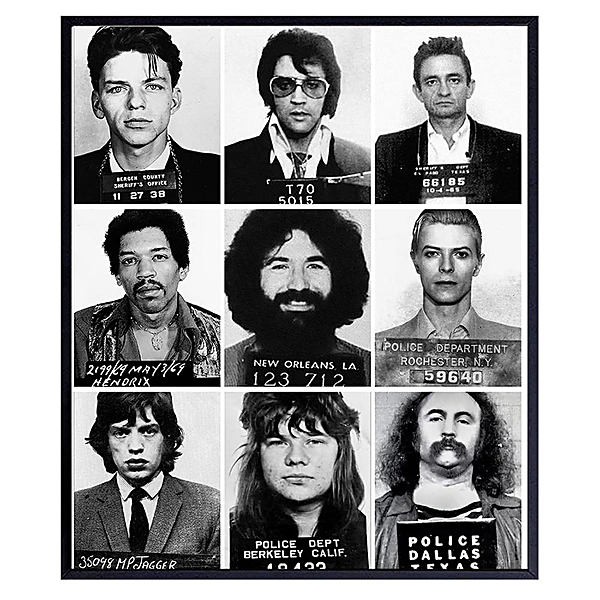

# Neil Young Archives Volume I [1963 - 1972] (DMD Album)

By Neil Young

## Album Data

- Catalog #: Roon
- Format: Digital, Album

## Track listing

1. Aurora
2. The Sultan
3. I Wonder
4. Mustang
5. I'll Love You Forever
6. (I'm a Man and) I Can't Cry
7. Hello Lonely Woman [Previously Unreleased Original Recording]
8. Casting Me Away From You [Previously Unreleased Original Recording]
9. There Goes My Babe [Previously Unreleased Original Recording]
10. Sugar Mountain
11. Nowadays Clancy Can't Even Sing
12. Runaround Babe
13. The Ballad of Peggy Grover
14. The Rent is Always Due
15. Extra, Extra
16. Flying On the Ground is Wrong
17. Burned
18. Out of My Mind
19. Down, Down, Down
20. Kahuna Sunset
21. Mr. Soul
22. Sell Out
23. Down To the Wire
24. Expecting To Fly
25. Slowly Burning
26. One More Sign
27. Broken Arrow
28. I Am a Child
29. Everybody Knows This Is Nowhere [45 RPM Single] [Stereo]
30. The Loner
31. Birds [Previously Unreleased Version]
32. What Did You Do to My Life? [Previously Unreleased Mix]
33. The Last Trip to Tulsa
34. Here We Are in the Years
35. I've Been Waiting for You [Previously Unreleased Mix]
36. The Old Laughing Lady
37. I've Loved Her So Long
38. Sugar Mountain [Stereo]
39. Nowadays Clancy Can't Even Sing [Live]
40. Down by the River
41. Cowgirl in the Sand
42. Everybody Knows This Is Nowhere
43. Emcee( Intro)/Sugar Mountain( Intro) [Live at the Riverboat 1969]
44. Sugar Mountain [Live at the Riverboat 1969] [Previously Limited Release]
45. Incredible Doctor Rap [Live at the Riverboat 1969]
46. The Old Laughing Lady [Live at the Riverboat 1969] [Previously Unreleased Live Version]
47. Audience Observation/Dope Song/Band Names Rap [Live at the Riverboat 1969]
48. Flying on the Ground Is Wrong [Live at the Riverboat 1969] [Previously Unreleased Live Version]
49. On the Way Home (Intro) [Live at the Riverboat 1969]
50. On the Way Home [Live at the Riverboat 1969] [Previously Limited Release]
51. Set Break/Emcee (Intro) [Live at the Riverboat 1969]
52. I've Loved Her So Long [Live at the Riverboat 1969] [Previously Unreleased Live Version]
53. Allen a-Dale Rap [Live at the Riverboat 1969]
54. I Am a Child [Live at the Riverboat 1969] [Previously Limited Release]
55. 1956 Bubblegum Disaster [Live at the Riverboat 1969] [Previously Unreleased Song]
56. The Last Trip to Tulsa [Live at the Riverboat 1969] [Previously Unreleased Live Version]
57. Words Rap [Live at the Riverboat 1969]
58. Broken Arrow [Live at the Riverboat 1969] [Previously Unreleased Live Version]
59. Turn Down the Lights Rap [Live at the Riverboat 1969]
60. Whiskey Boot Hill [Live at the Riverboat 1969] [Previously Unreleased Live Version]
61. Expecting to Fly Intro [Live at the Riverboat 1969]
62. Expecting to Fly [Live at the Riverboat 1969] [Previously Unreleased Live Version]
63. Cinnamon Girl
64. Running Dry (Requiem for the Rockets)
65. Round and Round (It Won't Be Long)
66. Oh Lonesome Me [Previously Unreleased Stereo Mix]
67. Birds [45 RPM Single] [Mono]
68. Everybody's Alone [Previously Unreleased Song]
69. I Believe in You
70. Sea of Madness [Live Woodstock Version]
71. Dance Dance Dance [Previously Unreleased Version]
72. Country Girl
73. Helpless [Previously Unreleased Mix]
74. It Might Have Been [Live]
75. Everybody Knows This Is Nowhere [Live at the Filmore East 1970]
76. Winterlong [Live at the Fillmore East 1970]
77. Down by the River [Live at the Fillmore East 1970]
78. Wonderin' [Live at the Fillmore East 1970]
79. Come On Baby Let's Go Downtown [Live at the Fillmore East 1970]
80. Cowgirl in the Sand [Live at the Fillmore East 1970]
81. Tell Me Why
82. After the Gold Rush
83. Only Love Can Break Your Heart
84. Wonderin' [Previously Unreleased Version]
85. Don't Let It Bring You Down
86. Cripple Creek Ferry
87. Southern Man
88. Till the Morning Comes
89. When You Dance, I Can Really Love
90. Ohio [45 RPM Single] [Stereo]
91. Only Love Can Break Your Heart [Live]
92. Tell Me Why [Live]
93. Music Is Love
94. See the Sky About to Rain [Live]
95. On the Way Home [Live at Massey Hall 1971]
96. Tell Me Why [Live at Massey Hall 1971]
97. Old Man [Live at Massey Hall 1971]
98. Journey Through the Past [Live at Massey Hall 1971]
99. Helpless [Live at Massey Hall 1971]
100. Love in Mind [Live at Massey Hall 1971]
101. A Man Needs a Maid/Heart of Gold (Suite) [Live at Massey Hall 1971]
102. Cowgirl in the Sand [Live at Massey Hall 1971]
103. Don't Let It Bring You Down [Live at Massey Hall 1971]
104. There's a World [Live at Massey Hall 1971]
105. Bad Fog of Loneliness [Live at Massey Hall 1971]
106. The Needle and the Damage Done [Live at Massey Hall 1971]
107. Ohio [Live at Massey Hall 1971]
108. See the Sky About to Rain [Live at Massey Hall 1971]
109. Down by the River [Live at Massey Hall 1971]
110. Dance Dance Dance [Live at Massey Hall 1971]
111. I Am a Child [Live at Massey Hall 1971]
112. Heart of Gold [Live]
113. The Needle and the Damage Done
114. Bad Fog of Loneliness [Previously Unreleased Version]
115. Old Man
116. Heart of Gold
117. Dance Dance Dance [Previously Unreleased Version]
118. A Man Needs a Maid [Previously Unreleased Mix]
119. Harvest
120. Journey Through the Past [Previously Unreleased Version]
121. Are You Ready for the Country?
122. Alabama
123. Words (Between the Lines of Age) [From the Original Soundtrack Album "Journey Through the Past"]
124. Soldier [Previously Unreleased Mix]
125. War Song [45 RPM Single] [Mono]

