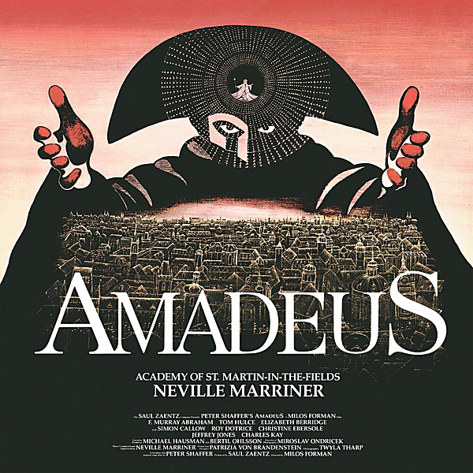

# Amadeus (The Complete Soundtrack Recording)

By Neville Marriner

## Album Data

- Catalog #: Roon
- Format: Digital, Album

## Track listing

1-1 Symphony No. 25 in G minor, K. 183 (K. 173dB): 1st Movement
1-2 Stabat mater, for soprano, alto, strings & organ in F minor: Quando Corpus Morietur & Amen
1-3 Bubak and Hungaricus (Early 18th Century Gypsy Music)
1-4 Serenade No. 10 for winds in B flat major ("Gran Partita"), K. 361 (K. 370a): 3rd Movement
1-5 Die Entführung aus dem Serail (The Abduction from the Seraglio), opera, K. 384: Turkish Finale
1-6 Symphony No. 29 in A major, K. 201 (K. 186a): 1st Movement
1-7 Concerto for 2 pianos & orchestra in E flat major ("Concerto No. 10"), K. 365 (K. 316a): 3rd Movement
1-8 Mass No. 17 for soloists, chorus & orchestra in C minor (fragment, "Great Mass"), K. 427 (K. 417a): Kyrie
1-9 Sinfonia concertante for violin, viola & orchestra in E flat major, K. 364 (K. 320d): 1st Movement
2-1 Piano Concerto No. 22 in E flat major, K. 482: 3rd Movement
2-2 Le nozze di Figaro (The Marriage of Figaro), opera, K. 492: Act 3: Ecco la marcia
2-3 Le nozze di Figaro (The Marriage of Figaro), opera, K. 492: Act 4: Ah tutti contenti
2-4 Don Giovanni, opera, K. 527: Act 2: Commendatore scene
2-5 Zaide, opera, K. 344 (K. 336b): Ruhe sanft, mein holdes Leben
2-6 Requiem for soloists, chorus, and orchestra, K. 626: Introitus (Eternal rest give to them, O Lord)
2-7 Requiem for soloists, chorus, and orchestra, K. 626: Dies Irae (Day of wrath)
2-8 Requiem for soloists, chorus, and orchestra, K. 626: Rex Tremendae Majestatis (Awe-inspiring King)
2-9 Requiem for soloists, chorus, and orchestra, K. 626: Confutatis (When those cursed enter flames)
2-10 Requiem for soloists, chorus, and orchestra, K. 626: Lacrymosa
2-11 Piano Concerto No. 20 in D minor, K. 466: 2nd Movement
3-1 The Magic Flute, K. 620: Overture
3-2 The Magic Flute, K. 620: Aria [No. 14], "Queen of the Night" [Der Hölle Rache Kocht]
3-3 Masonic Funeral Music, K. 477
3-4 Piano Concerto in D Minor, K. 466
3-5 Axur: Finale
3-6 Eine Kleine Nachtmusik [Seranade], K. 525: 1st Movement
3-7 Concerto for Flute and Harp, K. 299: 2nd Movement
3-8 Six German Dances K. 509: Nos. 1, 2, 3
3-9 Caro Mio Ben
3-10 The Abduction From the Seraglio, K384: Janissaries

