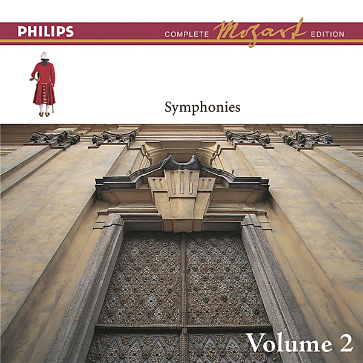

# Concertos Brandebourgeois & Suites pour orchestres

By Neville Marriner

## Album Data

- Catalog #: Roon
- Format: Digital, Album

## Track listing

1-1 Brandenburg Concerto No. 1 in F major, BWV 1046: 1. Allegro
1-2 Brandenburg Concerto No. 1 in F major, BWV 1046: 2. Adagio
1-3 Brandenburg Concerto No. 1 in F major, BWV 1046: 3. Allegro
1-4 Brandenburg Concerto No. 1 in F major, BWV 1046: 4. Menuet 1 - Trio 1 - Menuet 2 - Polonaise - Menuet 3 - Trio 2 - Menuet 4
1-5 Brandenburg Concerto No. 2 in F major, BWV 1047: 1. Allegro
1-6 Brandenburg Concerto No. 2 in F major, BWV 1047: 2. Andante
1-7 Brandenburg Concerto No. 2 in F major, BWV 1047: 3. Allegro assai
1-8 Brandenburg Concerto No. 3 in G major, BWV 1048: 1. Allegro
1-9 Brandenburg Concerto No. 3 in G major, BWV 1048: 2. Adagio
1-10 Brandenburg Concerto No. 3 in G major, BWV 1048: 3. Allegro
1-11 Brandenburg Concerto No. 4 in G major, BWV 1049: 1. Allegro
1-12 Brandenburg Concerto No. 4 in G major, BWV 1049: 2. Andante
1-13 Brandenburg Concerto No. 4 in G major, BWV 1049: 3. Presto
2-1 Brandenburg Concerto No. 5 in D major, BWV 1050: 1. Allegro
2-2 Brandenburg Concerto No. 5 in D major, BWV 1050: 2. Affettuoso
2-3 Brandenburg Concerto No. 5 in D major, BWV 1050: 3. Allegro
2-4 Brandenburg Concerto No. 6 in B flat major, BWV 1051: 1. Allegro
2-5 Brandenburg Concerto No. 6 in B flat major, BWV 1051: 2. Adagio ma non tanto
2-6 Brandenburg Concerto No. 6 in B flat major, BWV 1051: 3. Allegro
2-7 Orchestral Suite No. 1 in C major, BWV 1066: 1. Overture
2-8 Orchestral Suite No. 1 in C major, BWV 1066: 2. Courante
2-9 Orchestral Suite No. 1 in C major, BWV 1066: 3. Gavotte 1 & 2
2-10 Orchestral Suite No. 1 in C major, BWV 1066: 4. Forlane
2-11 Orchestral Suite No. 1 in C major, BWV 1066: 5. Menuet 1 & 2
2-12 Orchestral Suite No. 1 in C major, BWV 1066: 6. Bourrée 1 & 2
2-13 Orchestral Suite No. 1 in C major, BWV 1066: 7. Passepied 1 & 2
3-1 Orchestral Suite No. 2 in B minor, BWV 1067: 1. Overture
3-2 Orchestral Suite No. 2 in B minor, BWV 1067: 2. Rondeau
3-3 Orchestral Suite No. 2 in B minor, BWV 1067: 3. Sarabande
3-4 Orchestral Suite No. 2 in B minor, BWV 1067: 4. Bourrée 1 & 2
3-5 Orchestral Suite No. 2 in B minor, BWV 1067: 5. Polonaise
3-6 Orchestral Suite No. 2 in B minor, BWV 1067: 6. Menuet
3-7 Orchestral Suite No. 2 in B minor, BWV 1067: 7. Badinerie
3-8 Orchestral Suite No. 3 in D major, BWV 1068: 1. Overture
3-9 Orchestral Suite No. 3 in D major, BWV 1068: 2. Air
3-10 Orchestral Suite No. 3 in D major, BWV 1068: 3. Gavotte 1 & 2
3-11 Orchestral Suite No. 3 in D major, BWV 1068: 4. Bourrée
3-12 Orchestral Suite No. 3 in D major, BWV 1068: 5. Gigue
3-13 Orchestral Suite No. 4 in D major, BWV 1069: 1. Overture
3-14 Orchestral Suite No. 4 in D major, BWV 1069: 2. Bourrée 1 & 2
3-15 Orchestral Suite No. 4 in D major, BWV 1069: 3. Gavotte
3-16 Orchestral Suite No. 4 in D major, BWV 1069: 4. Menuet 1 & 2
3-17 Orchestral Suite No. 4 in D major, BWV 1069: 5. Réjouissance

