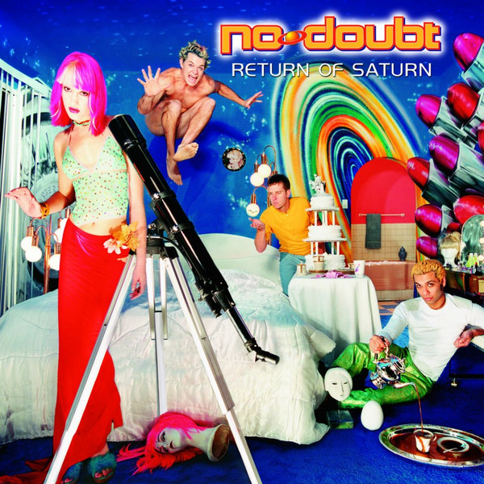

# Return Of Saturn

By No Doubt

## Album Data

- Catalog #: Roon
- Format: Digital, Album

## Track listing

1. Ex-Girlfriend
2. Simple Kind of Life
3. Bathwater
4. Six Feet Under
5. Magic's in the Makeup
6. Artificial Sweetener
7. Marry Me
8. New
9. Too Late
10. Comforting Lie
11. Suspension Without Suspense
12. Staring Problem
13. Home Now
14. Dark Blue
15. Too Late

## See also

- [Push And Shove (Deluxe)](Push_And_Shove_Deluxe.md)
- [Rock Steady (Expanded Edition)](Rock_Steady_Expanded_Edition.md)
- [Tragic Kingdom](Tragic_Kingdom.md)
- [Beets: No Doubt](../../Beets/No_Doubt/No_Doubt.md)
- [Beets: Push and Shove](../../Beets/No_Doubt/Push_and_Shove.md)
- [Beets: Return of Saturn](../../Beets/No_Doubt/Return_of_Saturn.md)
- [Beets: Rock Steady](../../Beets/No_Doubt/Rock_Steady.md)
- [Beets: The Beacon Street Collection](../../Beets/No_Doubt/The_Beacon_Street_Collection.md)
- [Beets: The Singles 1992–2003](../../Beets/No_Doubt/The_Singles_1992–2003.md)
- [Beets: Tragic Kingdom](../../Beets/No_Doubt/Tragic_Kingdom.md)
- [CD: ](../../CD/No_Doubt/No_Doubt.md)
- [CD: Tragic Kingdom](../../CD/No_Doubt/Tragic_Kingdom.md)
- [Vinyl: ](../../Vinyl/No_Doubt/No_Doubt.md)
- [Vinyl: Tragic Kingdom](../../Vinyl/No_Doubt/Tragic_Kingdom.md)
