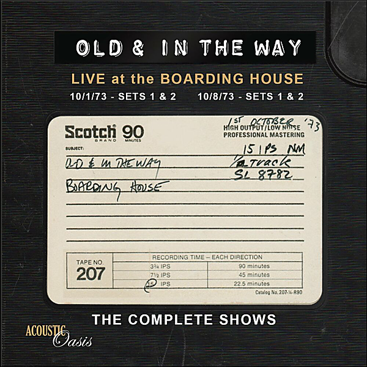

# The Complete Boarding House Shows

By Old & In the Way

## Album Data

- Catalog #: Roon
- Format: Digital, Album

## Track listing

1-1 On and On
1-2 I'm On My Way Back To the Old Home
1-3 Catfish John
1-4 Lonesome Fiddle Blues
1-5 Land of the Navajo
1-6 Down Where the River Bends
1-7 I Ain't Broke But I'm Badly Bent
1-8 Lost
1-9 Kissimee Kid
1-10 Lonesome L.a. Cowboy
1-11 Pig In a Pen
1-12 Wild Horses
1-13 Midnight Moonlight
2-1 Muleskinner Blues
2-2 Goin' To the Races
2-3 Old and In the Way
2-4 Old and In the Way Breakdown
2-5 Panama Red
2-6 Hard Hearted
2-7 That High Lonesome Sound
2-8 The Hobo Song
2-9 Drifting Too Far From the Shore
2-10 Angel Band
2-11 Wicked Path of Sin
2-12 Home is Where the Heart is
2-13 Uncle Pen
2-14 Orange Blossom Special
2-15 Blue Mule
3-1 Home is Where the Heart is
3-2 Love Please Come Home
3-3 Down Where the River Bends
3-4 Kissimee Kid
3-5 Pig In a Pen
3-6 Uncle Pen
3-7 Panama Red
3-8 Midnight Moonlight
3-9 White Dove
3-10 Wild Horses
3-11 Orange Blossom Special
3-12 Old and In the Way
3-13 Lonesome Fiddle Blues
4-1 On and On
4-2 Land of the Navajo
4-3 Catfish John
4-4 Til the End of the World Rolls 'Round
4-5 Drifting Too Far From the Shore
4-6 I'm Knocking On Your Door
4-7 Old & In the Way Breakdown
4-8 You'll Find Her Name Written There
4-9 Jerry's Breakdown
4-10 The Great Pretender
4-11 Working On a Building
4-12 That High Lonesome Sound
4-13 Wicked Path of Sin
4-14 Blue Mule

