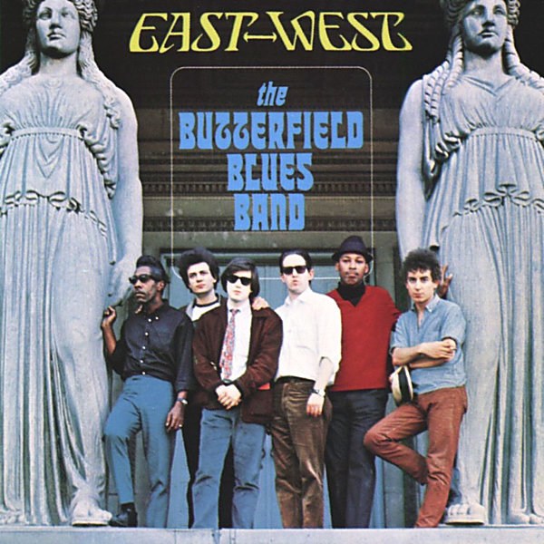

# East-West

By Paul Butterfield

## Album Data

- Catalog #: Roon
- Format: Digital, Album

## Track listing

1. Walkin' Blues
2. Get Out of My Life, Woman
3. I Got a Mind to Give Up Living
4. All These Blues
5. Work Song
6. Mary, Mary
7. Two Trains Running
8. Never Say No
9. East-West

## See also

- [In My Own Dream](In_My_Own_Dream.md)
- [Keep On Moving](Keep_On_Moving.md)
- [The Paul Butterfield Blues Band](The_Paul_Butterfield_Blues_Band.md)
- [The Resurrection Of Pigboy Crabshaw](The_Resurrection_Of_Pigboy_Crabshaw.md)
- [What's Shakin'](Whats_Shakin.md)
