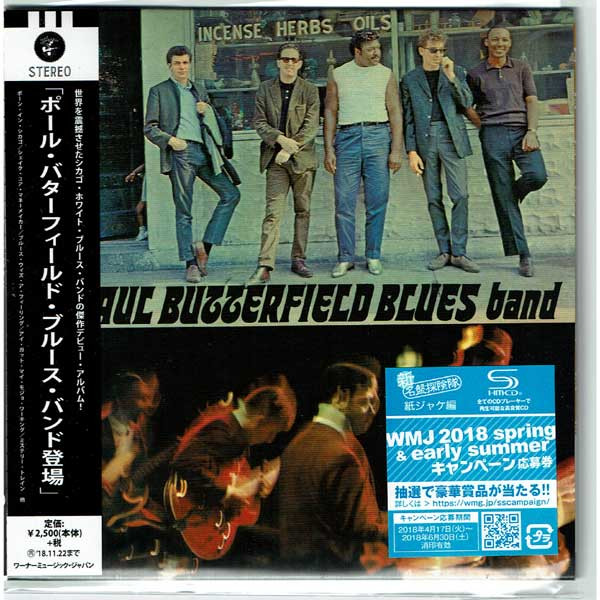

# The Paul Butterfield Blues Band

By Paul Butterfield

## Album Data

- Catalog #: Roon
- Format: Digital, Album

## Track listing

1. Born in Chicago
2. Shake Your Money-Maker
3. Blues with a Feeling
4. Thank You Mr. Poobah
5. I Got My Mojo Working
6. Mellow Down Easy
7. Screamin'
8. Our Love Is Drifting
9. Mystery Train
10. Last Night
11. Look Over Yonders Wall

## See also

- [East-West](East-West.md)
- [In My Own Dream](In_My_Own_Dream.md)
- [Keep On Moving](Keep_On_Moving.md)
- [The Resurrection Of Pigboy Crabshaw](The_Resurrection_Of_Pigboy_Crabshaw.md)
- [What's Shakin'](Whats_Shakin.md)
