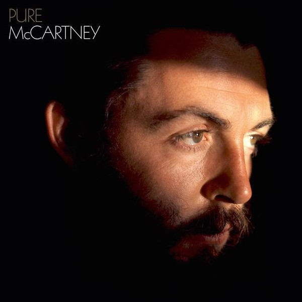

# Pure McCartney

By Paul McCartney

## Album Data

- Catalog #: Roon
- Format: Digital, Album

## Track listing

1-1 Maybe I'm Amazed
1-2 Heart of the Country
1-3 Jet
1-4 Warm and Beautiful
1-5 Listen to What the Man Said
1-6 Dear Boy
1-7 Silly Love Songs
1-8 The Song We Were Singing
1-9 Uncle Albert/Admiral Halsey
1-10 Early Days
1-11 Big Barn Red
1-12 Another Day
1-13 Flaming Pie
1-14 Jenny Wren
1-15 Too Many People
1-16 Let Me Roll It
1-17 New
2-1 Live and Let Die
2-2 English Tea
2-3 Mull of Kintyre
2-4 Save Us
2-5 My Love
2-6 Bip Bop
2-7 Let 'Em In
2-8 Nineteen Hundred and Eighty Five
2-9 Calico Skies
2-10 Hi, Hi, Hi
2-11 Waterfalls
2-12 Band on the Run
2-13 Appreciate
2-14 Sing the Changes
2-15 Arrow Through Me
2-16 Every Night
2-17 Junior's Farm
2-18 Mrs Vandebilt
3-1 Say Say Say (2015 remix)
3-2 My Valentine
3-3 Pipes of Peace
3-4 The World Tonight
3-5 Souvenir
3-6 Dance Tonight
3-7 Ebony and Ivory
3-8 Fine Line
3-9 Here Today
3-10 Press
3-11 Wanderlust
3-12 Winedark Open Sea
3-13 Beautiful Night
3-14 Girlfriend
3-15 Queenie Eye
3-16 We All Stand Together
4-1 Coming Up
4-2 Too Much Rain
4-3 Good Times Coming/Feel the Sun
4-4 Goodnight Tonight
4-5 Baby's Request
4-6 With a Little Luck
4-7 Little Willow
4-8 Only Mama Knows
4-9 Don't Let It Bring You Down
4-10 The Back Seat of My Car
4-11 No More Lonely Nights
4-12 Great Day
4-13 Venus and Mars/Rock Show
4-14 Temporary Secretary
4-15 Hope for the Future
4-16 Junk

## See also

- [Band On The Run](Band_On_The_Run.md)
- [McCartney (Archive Collection)](McCartney_Archive_Collection.md)
- [NEW (Deluxe Edition)](NEW_Deluxe_Edition.md)
- [Ram (Archive Collection)](Ram_Archive_Collection.md)
- [Wings At The Speed Of Sound (Archive Collection)](Wings_At_The_Speed_Of_Sound_Archive_Collection.md)
- [Wings Over America (Live / Remastered)](Wings_Over_America_Live_-_Remastered.md)
- [Wingspan](Wingspan.md)
- [Beets: All the Best](../../Beets/Paul_McCartney/All_the_Best.md)
- [Beets: McCartney](../../Beets/Paul_McCartney/McCartney.md)
- [Beets: Memory Almost Full](../../Beets/Paul_McCartney/Memory_Almost_Full.md)
- [Beets: New](../../Beets/Paul_McCartney/New.md)
- [Beets: Pure McCartney](../../Beets/Paul_McCartney/Pure_McCartney.md)
- [Beets: RAM](../../Beets/Paul_McCartney/RAM_2.md)
- [Beets: RAM](../../Beets/Paul_McCartney/RAM.md)
- [CD: Mccartney](../../CD/Paul_McCartney/Mccartney.md)
- [CD: ](../../CD/Paul_McCartney/Paul_McCartney.md)
- [CD: Ram](../../CD/Paul_McCartney/Ram.md)
- [Vinyl: McCartney](../../Vinyl/Paul_McCartney/McCartney.md)
- [Vinyl: ](../../Vinyl/Paul_McCartney/Paul_McCartney.md)
- [Vinyl: Press To Play](../../Vinyl/Paul_McCartney/Press_To_Play.md)
