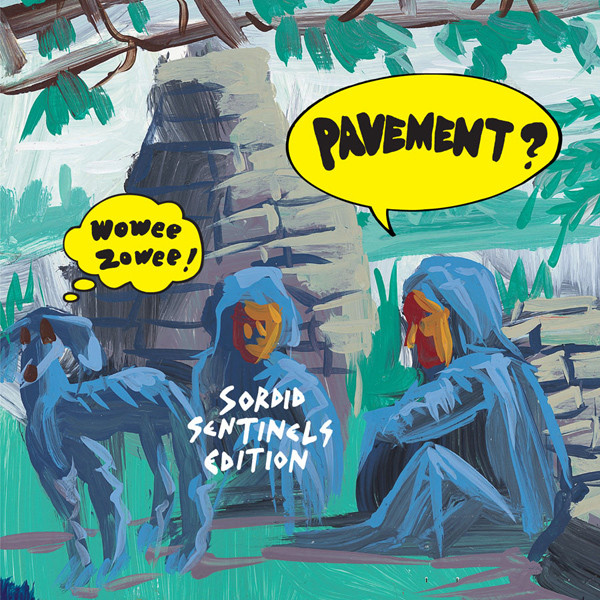

# Wowee Zowee (Sordid Sentinels Edition)

By Pavement

## Album Data

- Catalog #: Roon
- Format: Digital, Album

## Track listing

1-1 We Dance
1-2 Rattled by the Rush
1-3 Black Out
1-4 Brinx Job
1-5 Grounded
1-6 Serpentine Pad
1-7 Motion Suggests
1-8 Father to a Sister of Thought
1-9 Extradition
1-10 Best Friends Arm
1-11 Grave Architecture
1-12 AT & T
1-13 Flux = Rad
1-14 Fight This Generation
1-15 Kennel District
1-16 Pueblo
1-17 Half a Canyon
1-18 Western Homes
1-19 Sordid
1-20 Brink of the Clouds
1-21 False Skorpion
1-22 Easily Fooled
1-23 Kris Kraft
1-24 Mussle Rock (Is a Horse in Transition)
1-25 Give It a Day
1-26 Gangsters & Pranksters
1-27 Saganaw
1-28 I Love Perth
1-29 Sentinel
2-1 Sensitive Euro Man
2-2 Stray Fire
2-3 Fight This Generation [Recorded In Holland]
2-4 Easily Fooled [Recorded In Holland]
2-5 Soul Food
2-6 It's a Hectic World
2-7 Kris Kraft [In Bbc Studio]
2-8 Golden Boys/Serpentine Pad [In Bbc Studio]
2-9 Painted Soldiers [In Bbc Studio]
2-10 I Love Perth [In Bbc Studio]
2-11 Dancing with the Elders
2-12 Half a Canyon [Live In Australia]
2-13 Best Friend's Arm [Live In Australia]
2-14 Brink of the Clouds/Candylad
2-15 Unfair [Live In Australia]
2-16 Easily Fooled [Live In Australia]
2-17 Heaven is a Truck [Live In Australia]
2-18 Box Elder [Live In Australia]
2-19 No More Kings
2-20 Painted Soldiers
2-21 We Dance [Alternate Mix]

