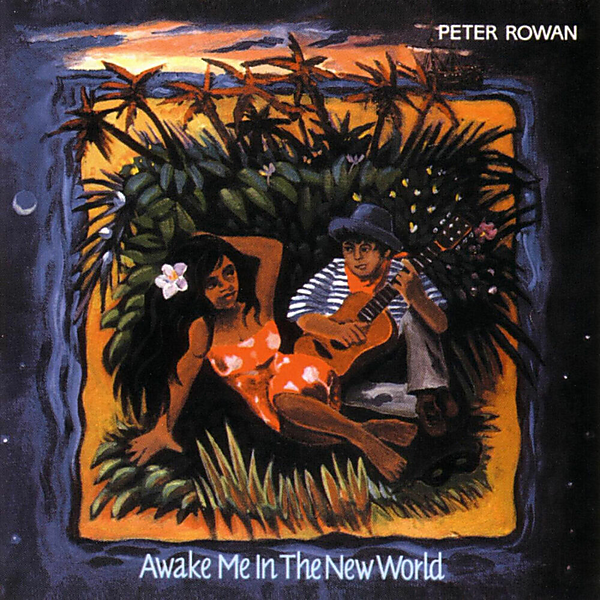

# Awake Me In The New World

By Peter Rowan

## Album Data

- Catalog #: Roon
- Format: Digital, Album

## Track listing

1. Shaman's Vision
2. Dreams of the Sea
3. Pulcinella Sails Away
4. Caribbean Woman
5. Dance With No Shoes
6. Sugar Cane
7. For Gods, for Kings & For Gold
8. Awake Me in the New World
9. All My Relations
10. Remember That I Love You
11. Maria de Las Rosas
12. African Banjo
13. Sailing Home
14. Dance of Pulcinella

## See also

- [Dharma Blues](Dharma_Blues.md)
- [Dust Bowl Children](Dust_Bowl_Children.md)
- [Peter Rowan](Peter_Rowan.md)
- [Quartet](Quartet.md)
- [Texican Badman](Texican_Badman.md)
- [The Walls Of Time](The_Walls_Of_Time.md)
- [Tree On A Hill](Tree_On_A_Hill.md)
- [Beets: Awake Me in the New World](../../Beets/Peter_Rowan/Awake_Me_in_the_New_World.md)
- [Beets: Dust Bowl Children](../../Beets/Peter_Rowan/Dust_Bowl_Children.md)
- [CD: Dust Bowl Children](../../CD/Peter_Rowan/Dust_Bowl_Children.md)
- [CD: ](../../CD/Peter_Rowan/Peter_Rowan.md)
