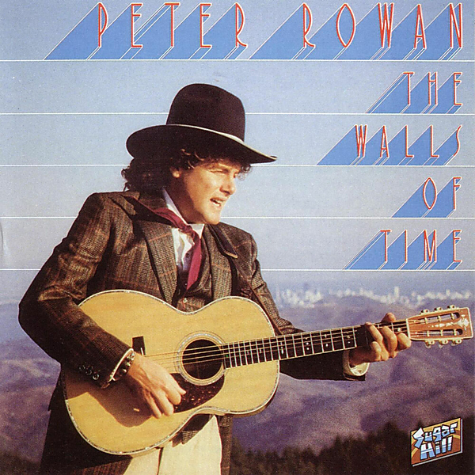

# The Walls Of Time

By Peter Rowan

## Album Data

- Catalog #: Roon
- Format: Digital, Album

## Track listing

1. Roving Gambler
2. Lone Pilgrim
3. Raglan Road (Dawning of the Day)
4. Going up on the Mountain
5. Casey's Last Ride
6. Old, Old House
7. Hiroshima Mon Amour
8. Willow Garden
9. Moonshiner
10. Thirsty in the Rain
11. Walls of Time
12. Plains of Waterloo

## See also

- [Awake Me In The New World](Awake_Me_In_The_New_World.md)
- [Dharma Blues](Dharma_Blues.md)
- [Dust Bowl Children](Dust_Bowl_Children.md)
- [Peter Rowan](Peter_Rowan.md)
- [Quartet](Quartet.md)
- [Texican Badman](Texican_Badman.md)
- [Tree On A Hill](Tree_On_A_Hill.md)
- [Beets: Awake Me in the New World](../../Beets/Peter_Rowan/Awake_Me_in_the_New_World.md)
- [Beets: Dust Bowl Children](../../Beets/Peter_Rowan/Dust_Bowl_Children.md)
- [CD: Dust Bowl Children](../../CD/Peter_Rowan/Dust_Bowl_Children.md)
- [CD: ](../../CD/Peter_Rowan/Peter_Rowan.md)
