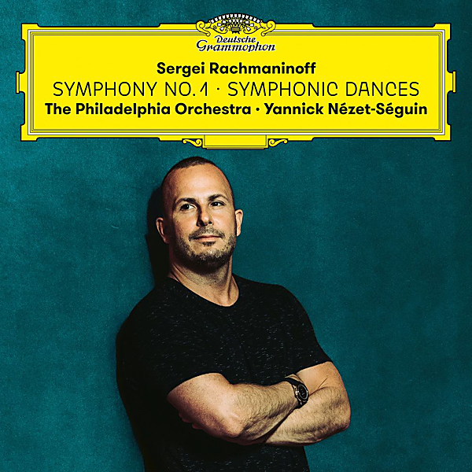

# Rachmaninoff: Symphony 1 + Symphonic Dances

By Philadelphia Orchestra

## Album Data

- Catalog #: Roon
- Format: Digital, Album

## Track listing

1. Symphony No. 1 in D minor, Op. 13: 1. Grave - Allegro ma non troppo
2. Symphony No. 1 in D minor, Op. 13: 2. Allegro animato
3. Symphony No. 1 in D minor, Op. 13: 3. Larghetto
4. Symphony No. 1 in D minor, Op. 13: 4. Allegro con fuoco
5. Symphonic Dances, Op. 45: 1. Non allegro
6. Symphonic Dances, op. 45: 2. Andante con moto (Tempo di valse)
7. Symphonic Dances, Op. 45: 3. Lento assai - Allegro vivace - Lento assai. Come prima - L'istesso tempo, ma agitato - Allegro vivace

