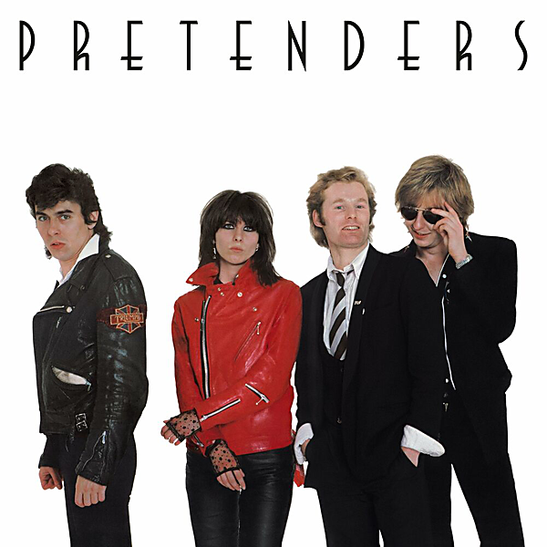

# Pretenders (Deluxe Edition)

By Pretenders

## Album Data

- Catalog #: Roon
- Format: Digital, Album

## Track listing

1-1 Precious
1-2 The Phone Call
1-3 Up the Neck
1-4 Tattooed Love Boys
1-5 Space Invader
1-6 The Wait
1-7 Stop Your Sobbing
1-8 Kid
1-9 Private Life
1-10 Brass in Pocket
1-11 Lovers of Today
1-12 Mystery Achievement
1-13 Cuban Slide
1-14 Porcelain
1-15 The Wait [Single Version]
1-16 Nervous But Shy
1-17 Swinging London
2-1 The Phone Call [Demo]
2-2 Suicide [Demo]
2-3 Brass in Pocket [Demo]
2-4 Precious [Demo]
2-5 Wait [Demo]
2-6 I Can't Control Myself [Demo]
2-7 Stop Your Sobbing [Demo]
2-8 Tequila [Demo]
2-9 Kid [Demo]
2-10 I Go to Sleep [Demo]
2-11 Do I Love You (with Sunshine Boys)
2-12 The Wait [BBC Live Session]
2-13 Up the Neck [BBC Live Session]
2-14 Stop Your Sobbing [BBC Live Session]
2-15 Private Life [BBC Live Session]
2-16 Cuban Slide [BBC Live Session]
2-17 Mystery Achievement [BBC Live Session]
2-18 I Need Somebody [BBC Live Session]
2-19 Tattooed Love Boys [BBC Live Session]
3-1 The Wait [BBC Live in London, Jan. 1979]
3-2 Stop Your Sobbing [BBC Live in London, Jan. 1979]
3-3 Kid [BBC Live in London, Jan. 1979]
3-4 Cuban Slide [BBC Live in London, Jan. 1979]
3-5 Brass in Pocket [BBC Live in London, Jan. 1979]
3-6 Tattooed Love Boys [BBC Live in London, Jan. 1979]
3-7 Mystery Achievement [BBC Live in London, Jan. 1979]
3-8 Space Invader [Live in Boston, March 1980]
3-9 The Wait [Live in Boston, March 1980]
3-10 Precious [Live in Boston, March 1980]
3-11 Kid [Live in Boston, March 1980]
3-12 Private Life [Live in Boston, March 1980]
3-13 Cuban Slide [Live in Boston, March 1980]
3-14 The Phone Call [Live in Boston, March 1980]
3-15 Talk of the Town [Live in Boston, March 1980]
3-16 Tattooed Love Boys [Live in Boston, March 1980]
3-17 Up the Neck [Live in Boston, March 1980]
3-18 Mystery Achievement [Live in Boston, March 1980]
3-19 Stop Your Sobbing [Live in Boston, March 1980]

