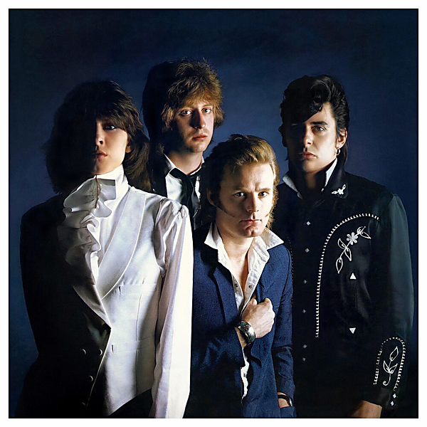

# Pretenders II (Deluxe Edition)

By Pretenders

## Album Data

- Catalog #: Roon
- Format: Digital, Album

## Track listing

1-1 The Adultress
1-2 Bad Boys Get Spanked
1-3 Message of Love
1-4 I Go to Sleep
1-5 Birds of Paradise
1-6 Talk of the Town
1-7 Pack It Up
1-8 Waste Not, Want Not
1-9 Day After Day
1-10 Jealous Dogs
1-11 The English Roses
1-12 Louie, Louie
2-1 Talk of the Town [Demo]
2-2 What You Gonna Do About It
2-3 I Go to Sleep [Guitar Version] [Outtake]
2-4 Pack It Up [Radio Mix] [Outtake]
2-5 Day After Day [Single Mix]
2-6 In the Sticks
2-7 Louie Louie [Monitor Mix]
2-8 Precious [Live in Central Park, August 1980]
2-9 Space Invader [Live in Central Park, August 1980]
2-10 Cuban Slide [Live in Central Park, August 1980]
2-11 Porcelain [Live in Central Park, August 1980]
2-12 Tattooed Love Boys [Live in Central Park, August 1980]
2-13 Up the Neck [Live in Central Park, August 1980]
3-1 The Wait [Live in Santa Monica, Sept. 1981]
3-2 The Adultress [Live in Santa Monica, Sept. 1981]
3-3 Message of Love (live in Santa Monica, Sept. 1981)
3-4 Louie Louie [Live in Santa Monica, Sept. 1981]
3-5 Talk of the Town [Live in Santa Monica, Sept. 1981]
3-6 Birds of Paradise [Live in Santa Monica, Sept. 1981]
3-7 English Roses
3-8 Stop Your Sobbing [Live in Santa Monica, Sept. 1981]
3-9 Private Life [Live in Santa Monica, Sept. 1981]
3-10 Kid [Live in Santa Monica, Sept. 1981]
3-11 Day After Day [Live in Santa Monica, Sept. 1981]
3-12 Up the Neck [Live in Santa Monica, Sept. 1981]
3-13 Bad Boys Get Spanked [Live in Santa Monica, Sept. 1981]
3-14 Tattooed Love Boys [Live in Santa Monica, Sept. 1981]
3-15 Precious [Live in Santa Monica, Sept. 1981]
3-16 Brass in Pocket [Live in Santa Monica, Sept. 1981]
3-17 Mystery Achievement
3-18 Higher and Higher [Live in Santa Monica, Sept. 1981]

