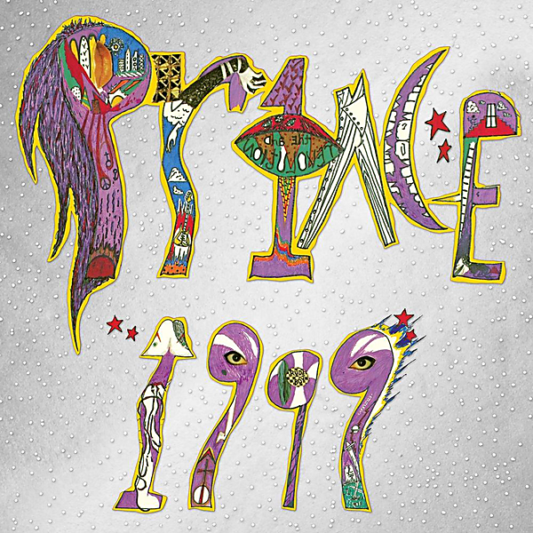

# 1999 (Super Deluxe Edition)

By Prince

## Album Data

- Catalog #: Roon
- Format: Digital, Album

## Track listing

1-1 1999
1-2 Little Red Corvette
1-3 Delirious
1-4 Let's Pretend We're Married
1-5 D.M.S.R.
1-6 Automatic
1-7 Something in the Water (Does Not Compute)
1-8 Free
1-9 Lady Cab Driver
1-10 All the Critics Love U in New York
1-11 International Lover
2-1 1999 [7" Stereo Edit]
2-2 1999 [7" Mono Promo-Only Edit]
2-3 Free [Promo-Only Edit]
2-4 How Come U Don't Call Me Anymore ["1999" B-Side]
2-5 Little Red Corvette [7" Edit]
2-6 All the Critics Love U in New York [7" Edit]
2-7 Lady Cab Driver [7" Edit]
2-8 Little Red Corvette [Dance Remix Promo-Only Edit]
2-9 Little Red Corvette [Special Dance Mix]
2-10 Delirious [7" Edit]
2-11 Horny Toad ["Delirious" B-Side]
2-12 Automatic [7" Edit]
2-13 Automatic [Video Version]
2-14 Let's Pretend We're Married [7" Edit]
2-15 Let's Pretend We're Married [7" Mono Promo-Only Edit]
2-16 Irresistible Bitch ["Let's Pretend We're Married" B-Side]
2-17 Let's Pretend We're Married [Video Version]
2-18 D.M.S.R. [Edit]
3-1 Feel U Up
3-2 Irresistible Bitch
3-3 Money Don't Grow on Trees
3-4 Vagina
3-5 Rearrange
3-6 Bold Generation
3-7 Colleen
3-8 International Lover [Take 1] [Live In Studio]
3-9 Turn It Up
3-10 You're All I Want
3-11 Something in the Water (Does Not Compute) [Original Version]
3-12 If It'll Make U Happy
3-13 How Come U Don't Call Me Anymore? [Take 2] [Live in Studio]
4-1 Possessed [1982 Version]
4-2 Delirious [Full-Length]
4-3 Purple Music
4-4 Yah, You Know
4-5 Moonbeam Levels
4-6 No Call U
4-7 Can't Stop This Feeling I Got
4-8 Do Yourself a Favor
4-9 Don't Let Him Fool Ya
4-10 Teacher, Teacher
4-11 Lady Cab Driver/I Wanna Be Your Lover/Head/Little Red Corvette [Tour Demo]
5-1 Controversy [Live at Masonic Hall, Detroit, MI, 11/30/1982 - Late Show]
5-2 Let's Work [Live at Masonic Hall, Detroit, MI, 11/30/1982 - Late Show]
5-3 Little Red Corvette [Live at Masonic Hall, Detroit, MI, 11/30/1982 - Late Show]
5-4 Do Me, Baby [Live at Masonic Hall, Detroit, MI, 11/30/1982 - Late Show]
5-5 Head [Live at Masonic Hall, Detroit, MI, 11/30/1982 - Late Show]
5-6 Uptown [Live at Masonic Hall, Detroit, MI, 11/30/1982 - Late Show]
5-7 Interlude [Live at Masonic Hall, Detroit, MI, 11/30/1982 - Late Show]
5-8 How Come U Don't Call Me Anymore? [Live at Masonic Hall, Detroit, MI, 11/30/1982 - Late Show]
5-9 Automatic [Live at Masonic Hall, Detroit, MI, 11/30/1982 - Late Show]
5-10 International Lover [Live at Masonic Hall, Detroit, MI, 11/30/1982 - Late Show]
5-11 1999 [Live at Masonic Hall, Detroit, MI, 11/30/1982 - Late Show]
5-12 D.M.S.R. [Live at Masonic Hall, Detroit, MI, 11/30/1982 - Late Show]

