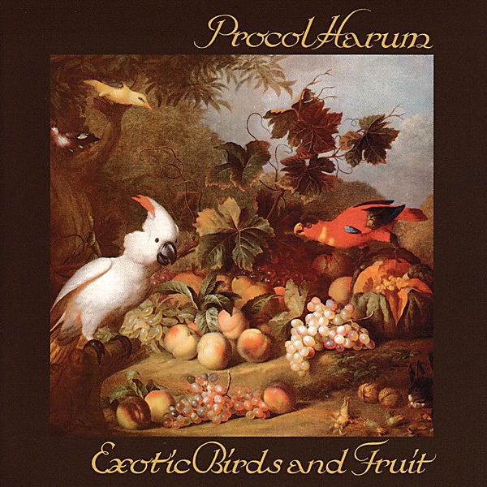

# Exotic Birds and Fruit (Expanded Edition)

By Procol Harum

## Album Data

- Catalog #: Roon
- Format: Digital, Album

## Track listing

1. Nothing But the Truth
2. Beyond the Pale
3. As Strong as Samson
4. The Idol
5. The Thin End of the Wedge
6. Monsieur R. Monde
7. Fresh Fruit
8. Butterfly Boys
9. New Lamps for Old
10. Drunk Again
11. As Strong as Samson [Alternative Mix in DB]
12. Conquistador [BBC Radio One in Concert 1974]
13. Whaling Stories
14. Bringing Home the Bacon [BBC Radio One in Concert 1974]
15. New Lamps for Old [BBC Radio One in Concert 1974]
16. Beyond the Pale [BBC Radio One in Concert 1974]
17. As Strong as Samson [BBC Radio in Concert 1974]
18. Simple Sister
19. The Idol [BBC Radio One in Concert 1974]
20. Grand Hotel
21. Butterfly Boys [BBC Radio One in Concert 1974]
22. Nothing But the Truth [BBC Radio One in Concert 1974]
23. Conquistador [Live at Dallas Sound Studio]
24. Bringing Home the Bacon [Live at Dallas Sound Studio]
25. Long Gone Geek
26. Homburg
27. Cerdes [Outside the Gates of]
28. Beyond the Pale [Live at Dallas Sound Studio]
29. Power Failure
30. As Strong as Samson [Live at Dallas Sound Studio]
31. The Idol [Alternate Take]
32. Butterfly Boys [Live at Dallas Sound Studio]
33. Mabel
34. Nothing But the Truth [Live at Dallas Sound Studio]
35. New Lamps for Old [Live at Dallas Sound Studio]

