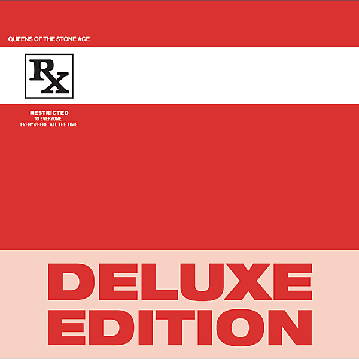

# Rated R - Deluxe Edition

By Queens of the Stone Age

## Album Data

- Catalog #: Roon
- Format: Digital, Album

## Track listing

1-1 Feel Good Hit of the Summer
1-2 The Lost Art of Keeping a Secret
1-3 Leg of Lamb
1-4 Auto Pilot
1-5 Better Living Through Chemistry
1-6 Monsters in the Parasol
1-7 Quick and to the Pointless
1-8 In the Fade/Feel Good Hit of the Summer (Reprise)
1-9 Tension Head
1-10 Lightning Song
1-11 I Think I Lost My Headache
2-1 Ode to Clarissa [Non-LP Version]
2-2 You're So Vague [Non-Lp Version]
2-3 Never Say Never [Non-Lp Version]
2-4 Who'll Be the Next in Line [Non-Lp Version]
2-5 Born to Hula [Non-LP Version]
2-6 Monsters in the Parasol [Live in Seattle, 2000]
2-7 Feel Good Hit of the Summer [Live at Reading, 2000]
2-8 Regular John [Live at Reading, 2000]
2-9 Avon [Live at Reading, 2000]
2-10 Quick and to the Pointless [Live at Reading, 2000]
2-11 Better Living Through Chemistry [Live at Reading, 2000]
2-12 Ode to Clarissa [Live at Reading, 2000]
2-13 The Lost Art of Keeping a Secret [Live at Reading, 2000]
2-14 You Can't Quit Me, Baby [Live at Reading, 2000]
2-15 Millionaire [Live at Reading, 2000]

