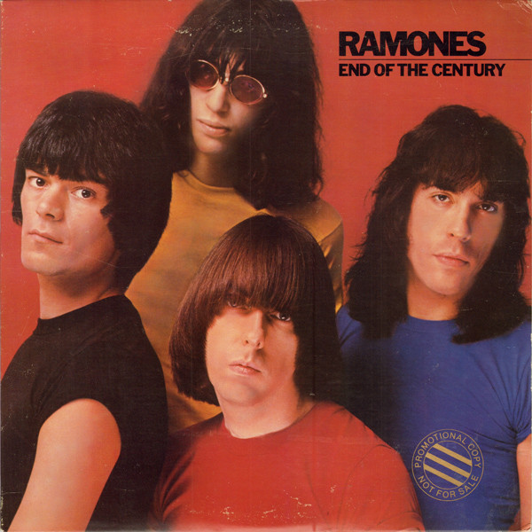

# End of the Century

By Ramones

## Album Data

- Catalog #: Roon
- Format: Digital, Album

## Track listing

1. Do You Remember Rock 'N' Roll Radio?
2. I'm Affected
3. Danny Says
4. Chinese Rock
5. The Return of Jackie and Judy
6. Let's Go
7. Baby, I Love You
8. I Can't Make It on Time
9. This Ain't Havana
10. Rock 'N' Roll High School
11. All the Way
12. High Risk Insurance

## See also

- [Leave Home (40th Anniversary Deluxe Edition)](Leave_Home_40th_Anniversary_Deluxe_Edition.md)
- [Mania](Mania.md)
- [Ramones](Ramones.md)
- [Road to Ruin (40th Anniversary Deluxe Edition)](Road_to_Ruin_40th_Anniversary_Deluxe_Edition.md)
- [Rocket to Russia (40th Anniversary Deluxe Edition)](Rocket_to_Russia_40th_Anniversary_Deluxe_Edition.md)
- [Subterranean Jungle (Expanded 2005 Remaster)](Subterranean_Jungle_Expanded_2005_Remaster.md)
- [Too Tough to Die](Too_Tough_to_Die.md)
- [Weird Tales of The Ramones (1976 - 1996) (Digital Version)](Weird_Tales_of_The_Ramones_1976_-_1996_Digital_Version.md)
