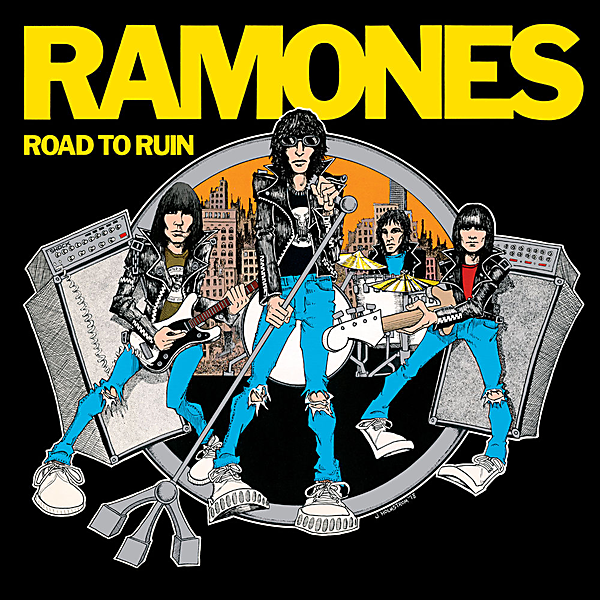

# Road to Ruin (40th Anniversary Deluxe Edition)

By Ramones

## Album Data

- Catalog #: Roon
- Format: Digital, Album

## Track listing

1-1 I Just Want to Have Something to Do
1-2 I Wanted Everything
1-3 Don't Come Close
1-4 I Don't Want You
1-5 Needles and Pins
1-6 I'm Against It
1-7 I Wanna Be Sedated
1-8 Go Mental
1-9 Questioningly
1-10 She's the One
1-11 Bad Brain
1-12 It's a Long Way Back
1-13 I Just Want To Have Something To Do [40th Anniversary Road Revisited Mix]
1-14 I Wanted Everything [40th Anniversary Road Revisited Mix]
1-15 Don't Come Close [40th Anniversary Road Revisited Mix]
1-16 I Don't Want You [40th Anniversary Road Revisited Mix]
1-17 Needles And Pins [40th Anniversary Road Revisited Mix]
1-18 I'm Against It [40th Anniversary Road Revisited Mix]
1-19 I Wanna Be Sedated [40th Anniversary Road Revisited Mix]
1-20 Go Mental [40th Anniversary Road Revisited Mix]
1-21 Questioningly [40th Anniversary Road Revisited Mix]
1-22 She's The One [40th Anniversary Road Revisited Mix]
1-23 Bad Brain [40th Anniversary Road Revisited Mix]
1-24 It's A Long Way Back [40th Anniversary Road Revisited Mix]
2-1 I Walk Out [2018 Mix]
2-2 S.L.U.G. [2018 Mix]
2-3 Don't Come Close [Single Mix]
2-4 Needles and Pins [Single Mix]
2-5 I Just Want To Have Something To Do [Basic Rough Mix]
2-6 I Don't Want You [Basic Rough Mix]
2-7 I'm Against It [Basic Rough Mix]
2-8 It's A Long Way Back [Basic Rough Mix]
2-9 I Walk Out [Basic Rough Mix]
2-10 Bad Brain [Basic Rough Mix]
2-11 Needles And Pins [Basic Rough Mix]
2-12 I Wanna Be Sedated [Basic Rough Mix]
2-13 I Wanted Everything [Basic Rough Mix]
2-14 Go Mental [Basic Rough Mix]
2-15 She's The One [Basic Rough Mix]
2-16 Questioningly Take 2 [Basic Rough Mix]
2-17 S.L.U.G. [Basic Rough Mix]
2-18 Don't Come Close [Basic Rough Mix]
2-19 I Wanna Be Sedated [Backing Track]
2-20 I Don't Want You [Brit Pop Mix]
2-21 Questioningly [Acoustic Version]
2-22 Needles And Pins [Acoustic Version]
2-23 Don't Come Close [Acoustic Version]
2-24 I Wanna Be Sedated [Ramones-on-45 Mega-Mix!]
3-1 Blitzkreig Bop
3-2 Teenage Labotomy
3-3 Rockaway Beach [Live at The Palladium, New York, NY 12/31/79]
3-4 I Don't Want You [Live at The Palladium, New York, NY 12/31/79]
3-5 Go Mental [Live at The Palladium, New York, NY 12/31/79]
3-6 Gimme Gimme Shock Treatment [Live at The Palladium, New York, NY 12/31/79]
3-7 I Wanna Be Sedated [Live at The Palladium, New York, NY 12/31/79]
3-8 I Just Want To Have Something To Do [Live at The Palladium, New York, NY 12/31/79]
3-9 She's The One [Live at The Palladium, New York, NY 12/31/79]
3-10 This Ain't Havana [Live at The Palladium, New York, NY 12/31/79]
3-11 I'm Against It [Live at The Palladium, New York, NY 12/31/79]
3-12 Sheena Is A Punk Rocker [Live at The Palladium, New York, NY 12/31/79]
3-13 Havana Affair [Live at The Palladium, New York, NY 12/31/79]
3-14 Commando [Live at The Palladium, New York, NY 12/31/79]
3-15 Needles And Pins [Live at The Palladium, New York, NY 12/31/79]
3-16 I Wanna Be Your Boyfriend [Live at The Palladium, New York, NY 12/31/79]
3-17 Surfin' Bird [Live at The Palladium, New York, NY 12/31/79]
3-18 Cretin Hop [Live at The Palladium, New York, NY 12/31/79]
3-19 All The Way [Live at The Palladium, New York, NY 12/31/79]
3-20 Judy Is A Punk [Live at The Palladium, New York, NY 12/31/79]
3-21 California Sun [Live at The Palladium, New York, NY 12/31/79]
3-22 I Don't Wanna Walk Around With You [Live at The Palladium, New York, NY 12/31/79]
3-23 Today Your Love, Tomorrow The World [Live at The Palladium, New York, NY 12/31/79]
3-24 Pinhead [Live at The Palladium, New York, NY 12/31/79]
3-25 Do You Wanna Dance? [Live at The Palladium, New York, NY 12/31/79]
3-26 Suzy Is A Headbanger [Live at The Palladium, New York, NY 12/31/79]
3-27 Let's Dance [Live at The Palladium, New York, NY 12/31/79]
3-28 Chinese Rock [Live at The Palladium, New York, NY 12/31/79]
3-29 Beat On The Brat [Live at The Palladium, New York, NY 12/31/79]
3-30 We're A Happy Family [Live at The Palladium, New York, NY 12/31/79]
3-31 Bad Brain [Live at The Palladium, New York, NY 12/31/79]
3-32 I Wanted Eveything

