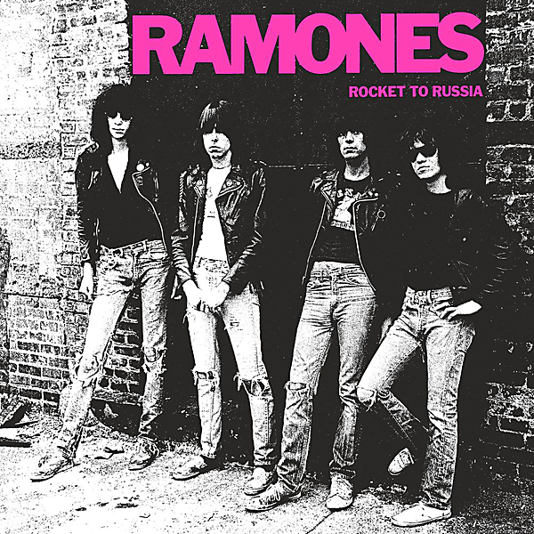

# Rocket to Russia (40th Anniversary Deluxe Edition)

By Ramones

## Album Data

- Catalog #: Roon
- Format: Digital, Album

## Track listing

1-1 Cretin Hop
1-2 Rockaway Beach
1-3 Here Today, Gone Tomorrow
1-4 Locket Love
1-5 I Don't Care
1-6 Sheena Is a Punk Rocker
1-7 We're a Happy Family
1-8 Teenage Lobotomy
1-9 Do You Wanna Dance?
1-10 I Wanna Be Well
1-11 I Can't Give You Anything
1-12 Ramona
1-13 Surfin' Bird
1-14 Why Is It Always This Way?
1-15 Cretin Hop [Tracking Mix]
1-16 Rockaway Beach [Tracking Mix]
1-17 Here Today, Gone Tomorrow [Tracking Mix]
1-18 Locket Love [Tracking Mix]
1-19 I Don't Care [Version 2] [Tracking Mix]
1-20 It's a Long Way Back to Germany [Version 1] [Tracking Mix]
1-21 We're a Happy Family [Tracking Mix]
1-22 Teenage Lobotomy [Tracking Mix]
1-23 Do You Wanna Dance? [Tracking Mix]
1-24 I Wanna Be Well [Tracking Mix]
1-25 I Can't Give You Anything [Tracking Mix]
1-26 Ramona [Tracking Mix]
1-27 Surfin' Bird [Tracking Mix]
1-28 Why Is It Always This Way? [Tracking Mix]
2-1 Why Is It Always This Way? [Mediasound Rough] [Alternate Lyrics]
2-2 Rockaway Beach [Power Station Rough]
2-3 I Wanna Be Well [Power Station Rough]
2-4 Locket Love [Power Station Rough]
2-5 I Can't Give You Anything [Power Station Rough]
2-6 Cretin Hop [Power Station Rough]
2-7 We're a Happy Family [Power Station Rough]
2-8 Ramona [Mediasound Rough, Alternate Lyrics]
2-9 Do You Wanna Dance? [Mediasound Rough]
2-10 Teenage Lobotomy [Mediasound Rough]
2-11 Here Today, Gone Tomorrow [Mediasound Rough]
2-12 I Don't Care [Version 2] [Mediasound Rough]
2-13 Here Today, Gone Tomorrow [Acoustic Version]
2-14 It's a Long Way Back to Germany [Version 1] [Dee Dee Vocal]
2-15 Ramona [Sweet Little Ramona Pop Mix]
2-16 Surfin' Bird [Alternate Vocal]
2-17 Teenage Lobotomy [Backing Track]
2-18 We're a Happy Family (At Home With the Family)
2-19 Cretin Hop [Backing Track]
2-20 Needles and Pins [Demo Version]
2-21 Babysitter [B-Side Version]
2-22 It's a Long Way Back to Germany [B-Side Version]
2-23 Joey RTR Radio Spot Promo
2-24 We're a Happy Family [Joey & Dee Dee Dialogue]
3-1 Rockaway Beach [Live at Apollo Centre, Glasgow, Scotland, 12/19/1977]
3-2 Teenage Lobotomy [Live at Apollo Centre, Glasgow, Scotland, 12/19/1977]
3-3 Blitzkrieg Bop [Live at Apollo Centre, Glasgow, Scotland, 12/19/1977]
3-4 I Wanna Be Well [Live at Apollo Centre, Glasgow, Scotland, 12/19/1977]
3-5 Glad to See You Go [Live at Apollo Centre, Glasgow, Scotland, 12/19/1977]
3-6 Gimme Gimme Shock Treatment [Live at Apollo Centre, Glasgow, Scotland, 12/19/1977]
3-7 You're Gonna Kill That Girl [Live at Apollo Centre, Glasgow, Scotland, 12/19/1977]
3-8 I Don't Care [Live at Apollo Centre, Glasgow, Scotland, 12/19/1977]
3-9 Sheena Is a Punk Rocker [Live at Apollo Centre, Glasgow, Scotland, 12/19/1977]
3-10 Carbona Not Glue [Live at Apollo Centre, Glasgow, Scotland, 12/19/1977]
3-11 Commando [Live at Apollo Centre, Glasgow, Scotland, 12/19/1977]
3-12 Here Today, Gone Tomorrow [Live at Apollo Centre, Glasgow, Scotland, 12/19/1977]
3-13 Surfin' Bird [Live at Apollo Centre, Glasgow, Scotland, 12/19/1977]
3-14 Cretin Hop [Live at Apollo Centre, Glasgow, Scotland, 12/19/1977]
3-15 Listen to My Heart [Live at Apollo Centre, Glasgow, Scotland, 12/19/1977]
3-16 California Sun [Live at Apollo Centre, Glasgow, Scotland, 12/19/1977]
3-17 I Don't Wanna Walk Around With You [Live at Apollo Centre, Glasgow, Scotland, 12/19/1977]
3-18 Pinhead [Live at Apollo Centre, Glasgow, Scotland, 12/19/1977]
3-19 Do You Wanna Dance? [Live at Apollo Centre, Glasgow, Scotland, 12/19/1977]
3-20 Chain Saw [Live at Apollo Centre, Glasgow, Scotland, 12/19/1977]
3-21 Today Your Love, Tomorrow the World [Live at Apollo Centre, Glasgow, Scotland, 12/19/1977]
3-22 Now I Wanna Be a Good Boy [Live at Apollo Centre, Glasgow, Scotland, 12/19/1977]
3-23 Judy Is a Punk [Live at Apollo Centre, Glasgow, Scotland, 12/19/1977]
3-24 Now I Wanna Sniff Some Glue [Live at Apollo Centre, Glasgow, Scotland, 12/19/1977]
3-25 We're a Happy Family [Live at Apollo Centre, Glasgow, Scotland, 12/19/1977]

