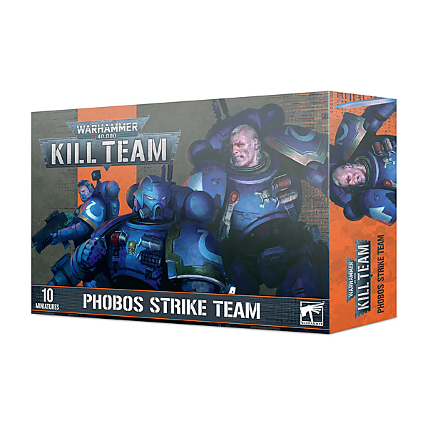

# Weird Tales of The Ramones (1976 - 1996) (Digital Version)

By Ramones

## Album Data

- Catalog #: Roon
- Format: Digital, Album

## Track listing

1. Blitzkrieg Bop
2. Beat on the Brat
3. Judy Is a Punk
4. I Wanna Be Your Boyfriend
5. Loudmouth
6. 53rd & 3rd
7. Havana Affair
8. Now I Wanna Sniff Some Glue
9. Glad to See You Go
10. Gimme Gimme Shock Treatment
11. I Remember You
12. Carbona Not Glue
13. Oh, Oh, I Love Her So
14. Swallow My Pride
15. Commando
16. Pinhead
17. Sheena Is a Punk Rocker
18. I Don't Care
19. Rockaway Beach
20. Cretin Hop
21. Here Today, Gone Tomorrow
22. Teenage Lobotomy
23. Slug [Demo]
24. Surfin' Bird
25. We're a Happy Family
26. I Just Want to Have Something to Do
27. I Wanted Everything
28. Needles & Pins
29. I Wanna Be Sedated
30. Go Mental
31. Don't Come Close
32. I Don't Want You
33. She's the One
34. I'm Against It
35. Rock 'N' Roll High School [Ed Stasium Version]
36. I Want You Around [Ed Stasium Version]
37. Do You Remember Rock and Roll Radio
38. I'm Affected
39. Danny Says
40. The KKK Took My Baby Away
41. You Sound Like Your Sick
42. She's a Sensation
43. All's Quiet on the Eastern Front
44. Outsider
45. Highest Trails Above
46. Psycho Therapy
47. Time Bomb
48. Mama's Boy
49. I'm Not Afraid of Life
50. Too Tough to Die
51. Wart Hog
52. Howling at the Moon (Sha-La-La)
53. Daytime Dilemma (Dangers of Love)
54. Endless Vacation
55. My Brain Is Hanging Upside Down (Bonzo Goes to Bitburg) [UK 12" Version]
56. Somebody Put Something in My Drink
57. Animal Boy
58. I Don't Want to LiveThis Life (Anymore)
59. Love Kills
60. Something to Believe in
61. I Wanna Live
62. Bop 'Til You Drop
63. I Lost My MInd
64. Garden of Serenity
65. I Believe in Miracles
66. Pet Sematary
67. Punishment Fits the Crime
68. Merry Christmas (I Don't Wanna Fight Tonight)
69. Main Man
70. Strength to Endure
71. Poison Heart
72. I Won't Let It Happen
73. Censorshit
74. Journey to the Center of the Mind
75. 7 and 7 Is
76. When I Was Young
77. I Don't Wanna Grow Up
78. Scattergun
79. Makin' Monsters for My Friends
80. The Crusher
81. Spiderman
82. Life's a Gas
83. She Talks to Rainbows
84. Any Way You Want It
85. R.A.M.O.N.E.S.

