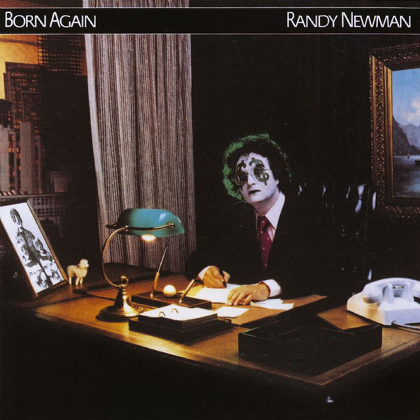

# Born Again

By Randy Newman

## Album Data

- Catalog #: Roon
- Format: Digital, Album

## Track listing

1. It's Money That I Love
2. The Story of a Rock & Roll Band
3. Pretty Boy
4. Mr. Sheep
5. Ghosts
6. They Just Got Married
7. Spies
8. The Girls in My Life, Pt. 1
9. Half a Man
10. William Brown
11. Pants

## See also

- [Faust (Deluxe Edition)](Faust_Deluxe_Edition.md)
- [Sail Away (Expanded & Remastered Edition)](Sail_Away_Expanded_and_Remastered_Edition.md)
- [The Randy Newman Songbook, Vol. 1](The_Randy_Newman_Songbook__Vol_1.md)
- [Beets: Born Again](../../Beets/Randy_Newman/Born_Again.md)
- [Beets: Good Old Boys](../../Beets/Randy_Newman/Good_Old_Boys.md)
- [Beets: Little Criminals](../../Beets/Randy_Newman/Little_Criminals.md)
- [Beets: Randy Newman](../../Beets/Randy_Newman/Randy_Newman.md)
- [Beets: Randy Newman's Faust](../../Beets/Randy_Newman/Randy_Newmans_Faust.md)
- [Beets: Sail Away](../../Beets/Randy_Newman/Sail_Away.md)
- [Beets: The Randy Newman Songbook](../../Beets/Randy_Newman/The_Randy_Newman_Songbook.md)
- [Vinyl: ](../../Vinyl/Randy_Newman/Randy_Newman.md)
- [Vinyl: The Randy Newman Songbook](../../Vinyl/Randy_Newman/The_Randy_Newman_Songbook.md)
