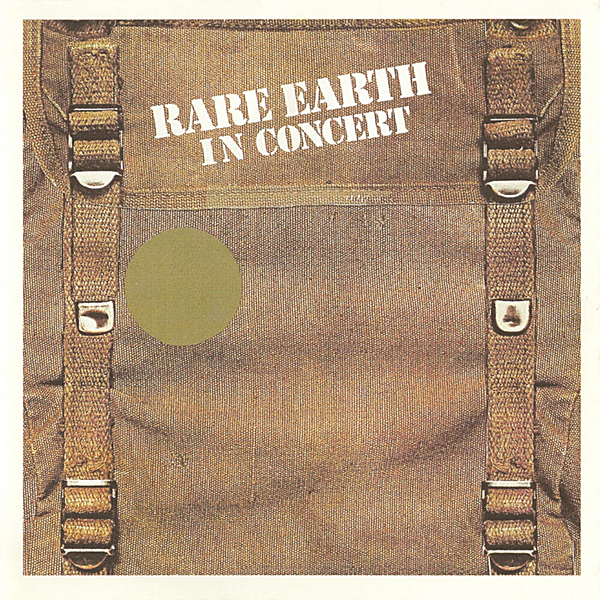

# In Concert (Live In Concert, US/1971)

By Rare Earth

## Album Data

- Catalog #: Roon
- Format: Digital, Album

## Track listing

1. I Just Want To Celebrate [Live In Concert, Us/1971]
2. Hey, Big Brother [Live In Concert, Us/1971]
3. Born To Wander [Live In Concert, Us/1971]
4. Get Ready [Live In Concert, Us/1971]
5. What'd I Say [Live In Concert, Us/1971]
6. Thoughts [Live In Concert, Us/1971]
7. (I Know) I'm Losing You [Live In Concert, Us/1971]
8. Nice To Be With You [Live In Concert, Us/1971]

## See also

- [Dreams/Answers](Dreams-Answers.md)
- [Ecology](Ecology.md)
- [Get Ready](Get_Ready.md)
- [Beets: 20th Century Masters](../../Beets/Rare_Earth/20th_Century_Masters.md)
- [Beets: Ecology](../../Beets/Rare_Earth/Ecology.md)
- [Beets: Get Ready](../../Beets/Rare_Earth/Get_Ready.md)
- [CD: 20th Century Masters](../../CD/Rare_Earth/20th_Century_Masters-_The_Millennium_Collection-_The_Best_Of_Rare_Earth.md)
- [CD: ](../../CD/Rare_Earth/Rare_Earth.md)
- [Vinyl: Get Ready](../../Vinyl/Rare_Earth/Get_Ready.md)
- [Vinyl: ](../../Vinyl/Rare_Earth/Rare_Earth.md)
