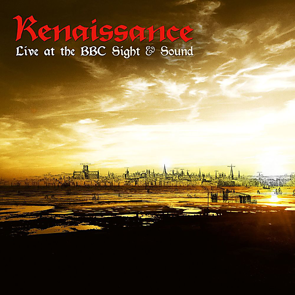

# Live at the BBC - Sight & Sound

By Renaissance

## Album Data

- Catalog #: Roon
- Format: Digital, Album

## Track listing

1. Introduction (Live from the Golders Green Hippodrome 1977)
2. Carpet of the Sun (Live from the Golders Green Hippodrome 1977)
3. Mother Russia (Live from the Golders Green Hippodrome 1977)
4. Can You Hear Me? (Live from the Golders Green Hippodrome 1977)
5. Ocean Gypsy (Live from the Golders Green Hippodrome 1977)
6. Running Hard (Live from the Golders Green Hippodrome 1977)
7. Band Introduction (Live from the Golders Green Hippodrome 1977)
8. Touching Once (Is so Hard to Keep) (Live from the Golders Green Hippodrome 1977)
9. Prologue (Live from the Golders Green Hippodrome 1977)
10. Running Hard (Live from the Golders Green Hippodrome 1975)
11. Mother Russia (Live from the Golders Green Hippodrome 1975)
12. Prologue (Live from the Golders Green Hippodrome 1975)
13. Ocean Gypsy (Live from the Golders Green Hippodrome 1975)
14. Ashes Are Burning (Live from the Golders Green Hippodrome 1975)
15. Day of the Dreamer (Radio 1 Live Sessions 1978)
16. The Vultures Fly High (Radio 1 Live Sessions 1978)
17. Midas Man (Radio 1 Live Sessions 1978)
18. Prologue (Live from the Paris Theatre 1976)
19. Running Hard (Live at the Paris Theatre 1976)
20. Ocean Gypsy (Live at the Paris Theatre 1976)
21. Mother Russia (Live at the Paris Theatre 1976)
22. Song of Scheherazade (Live at the Paris Theatre 1976)

