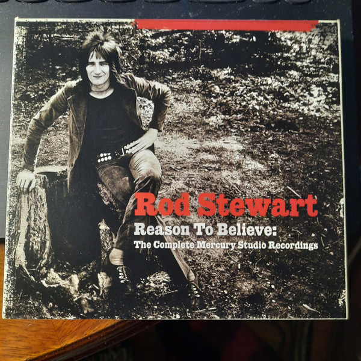

# Reason To Believe: The Complete Mercury Recordings

By Rod Stewart

## Album Data

- Catalog #: Roon
- Format: Digital, Album

## Track listing

1-1 Street Fighting Man
1-2 Man of Constant Sorrow
1-3 Blind Prayer
1-4 Handbags and Gladrags
1-5 An Old Raincoat Won't Ever Let You Down
1-6 I Wouldn't Ever Change a Thing
1-7 Cindy's Lament
1-8 Dirty Old Town
1-9 Gasoline Alley
1-10 It's All Over Now
1-11 Only a Hobo
1-12 My Way of Giving
1-13 Country Comfort
1-14 Cut Across Shorty
1-15 Lady Day
1-16 Jo's Lament
1-17 You're My Girl (I Don't Want to Discuss It)
1-18 It's All Over Now [Single Version]
2-1 Every Picture Tells A Story [Album Version]
2-2 Seems Like a Long Time
2-3 That's All Right/Amazing Grace
2-4 Tomorrow Is a Long Time
2-5 Maggie May
2-6 Mandolin Wind
2-7 (I Know) I'm Losing You
2-8 (Find A) Reason to Believe
2-9 True Blue
2-10 Lost Paraguayos
2-11 Mama, You Been on My Mind
2-12 Italian Girls
2-13 Angel [Album Version]
2-14 Interludings
2-15 You Wear It Well
2-16 I'd Rather Go Blind
2-17 Twistin' the Night Away
2-18 What's Made Milwaukee Famous (Has Made a Loser Out of Me) [Single Version]
3-1 Pinball Wizard
3-2 Oh! No Not My Baby [Single Version]
3-3 Jodie [Single Version]
3-4 Sweet Little Rock & Roller
3-5 Lochinvar
3-6 Farewell
3-7 Sailor
3-8 Bring It on Home to Me/You Send Me
3-9 Let Me Be Your Car
3-10 (You Make Me Feel Like) A Natural Man
3-11 Dixie Toot
3-12 Hard Road
3-13 I've Grown Accustomed to Her Face
3-14 Girl from the North Country
3-15 Mine for Me
3-16 Missed You
3-17 You Put Something Better Inside Me
3-18 Crying Laughing Loving Lying
3-19 Ev'ry Time We Say Goodbye
3-20 So Tired

## See also

- [Every Picture Tells A Story](Every_Picture_Tells_A_Story.md)
- [Beets: Every Picture Tells a Story](../../Beets/Rod_Stewart/Every_Picture_Tells_a_Story.md)
- [Beets: Reason To Believe](../../Beets/Rod_Stewart/Reason_To_Believe_2_3.md)
- [Beets: Reason To Believe](../../Beets/Rod_Stewart/Reason_To_Believe_2.md)
- [Beets: Reason To Believe](../../Beets/Rod_Stewart/Reason_To_Believe.md)
- [CD: Reason To Believe](../../CD/Rod_Stewart/Reason_To_Believe-_The_Complete_Mercury_Studio_Recordings_Disc_1.md)
- [CD: Reason To Believe](../../CD/Rod_Stewart/Reason_To_Believe-_The_Complete_Mercury_Studio_Recordings_Disc_2.md)
- [CD: Reason To Believe](../../CD/Rod_Stewart/Reason_To_Believe-_The_Complete_Mercury_Studio_Recordings_Disc_3.md)
- [CD: ](../../CD/Rod_Stewart/Rod_Stewart.md)
- [Vinyl: Every Picture Tells A Story](../../Vinyl/Rod_Stewart/Every_Picture_Tells_A_Story.md)
- [Vinyl: Gasoline Alley](../../Vinyl/Rod_Stewart/Gasoline_Alley.md)
- [Vinyl: ](../../Vinyl/Rod_Stewart/Rod_Stewart.md)
