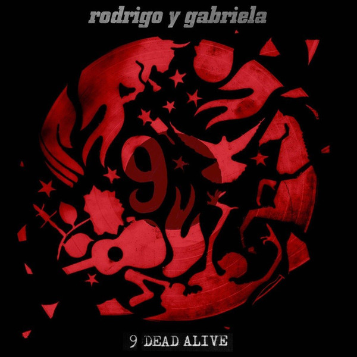

# 9 Dead Alive

By Rodrigo y Gabriela

## Album Data

- Catalog #: Roon
- Format: Digital, Album

## Track listing

1. The Soundmaker (Antonio de Torres Jurado, 1817-1892)
2. Torito (Animals and Nature)
3. Sunday Neurosis (Viktor Frankl, 1905-1997)
4. Misty Moses (Harriet Tubman, 1820-1913)
5. Somnium (Sor Juana Ines de la Cruz, 1651-1695)
6. Fram (Fridtjof Nansen, 1861-1930)
7. Megalopolis (Gabriela Mistral, 1889-1957)
8. The Russian Messenger (Fyodor Dostoyevsky, 1821-1881)
9. La Salle des Pas Perdus (Eleanor of Acquitane, 1122-1204)

