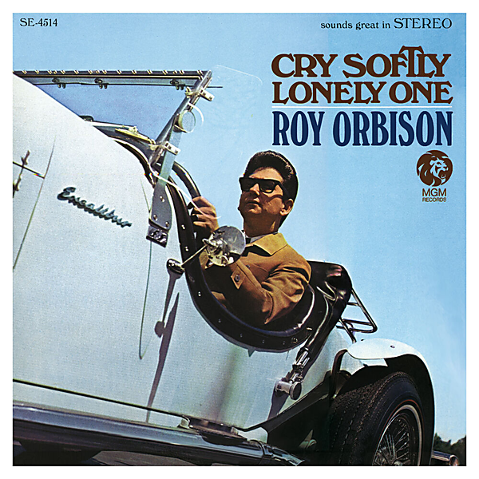

# Cry Softly Lonely One (Remastered)

By Roy Orbison

## Album Data

- Catalog #: Roon
- Format: Digital, Album

## Track listing

1. She
2. Communication Breakdown
3. Cry Softly, Lonely One
4. Girl Like Mine
5. It Takes One (To Know One)
6. Just Let Me Make Believe
7. Here Comes the Rain, Baby
8. That's a No No
9. Memories
10. Time to Cry
11. Only Alive

## See also

- [A Love So Beautiful](A_Love_So_Beautiful-_Roy_Orbison_and_The_Royal_Philharmonic_Orchestra_with_The_Royal_Philharmonic_Orchestra.md)
- [Black & White Night](Black_and_White_Night.md)
- [Crying](Crying.md)
- [In Dreams](In_Dreams.md)
- [Mystery Girl](Mystery_Girl.md)
- [Oh, Pretty Woman](Oh__Pretty_Woman.md)
- [Sings Lonely and Blue](Sings_Lonely_and_Blue.md)
- [The Classic Roy Orbison (Remastered)](The_Classic_Roy_Orbison_Remastered.md)
- [The Essential Roy Orbison](The_Essential_Roy_Orbison.md)
- [Beets: 20 Golden Hits](../../Beets/Roy_Orbison/20_Golden_Hits.md)
- [Beets: In Dreams](../../Beets/Roy_Orbison/In_Dreams.md)
- [Beets: Unknown Album (7/31/2005 4](../../Beets/Roy_Orbison/Unknown_Album_7-31-2005_4.md)
