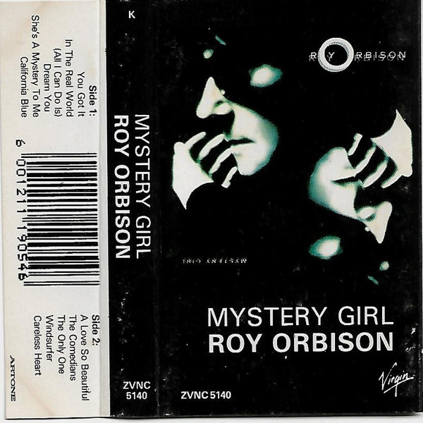

# Mystery Girl

By Roy Orbison

## Album Data

- Catalog #: Roon
- Format: Digital, Album

## Track listing

1. You Got It
2. In the Real World
3. (All I Can Do Is) Dream You
4. A Love So Beautiful
5. California Blue
6. She's a Mystery to Me
7. The Comedians
8. The Only One
9. Windsurfer
10. Careless Heart
11. You May Feel Me Crying

## See also

- [A Love So Beautiful](A_Love_So_Beautiful-_Roy_Orbison_and_The_Royal_Philharmonic_Orchestra_with_The_Royal_Philharmonic_Orchestra.md)
- [Black & White Night](Black_and_White_Night.md)
- [Crying](Crying.md)
- [Cry Softly Lonely One (Remastered)](Cry_Softly_Lonely_One_Remastered.md)
- [In Dreams](In_Dreams.md)
- [Oh, Pretty Woman](Oh__Pretty_Woman.md)
- [Sings Lonely and Blue](Sings_Lonely_and_Blue.md)
- [The Classic Roy Orbison (Remastered)](The_Classic_Roy_Orbison_Remastered.md)
- [The Essential Roy Orbison](The_Essential_Roy_Orbison.md)
- [Beets: 20 Golden Hits](../../Beets/Roy_Orbison/20_Golden_Hits.md)
- [Beets: In Dreams](../../Beets/Roy_Orbison/In_Dreams.md)
- [Beets: Unknown Album (7/31/2005 4](../../Beets/Roy_Orbison/Unknown_Album_7-31-2005_4.md)
