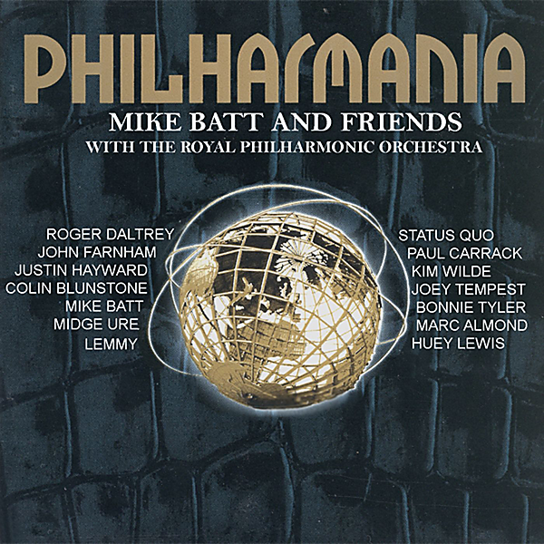

# Philharmania

By Royal Philharmonic Orchestra

## Album Data

- Catalog #: Roon
- Format: Digital, Album

## Track listing

1. Born to Run
2. A Whiter Shade of Pale
3. No Face, No Name, No Number
4. I Put a Spell on You
5. Paint It Black
6. Bright Eyes
7. The Boys of Summer
8. Eve of Destruction
9. Night in White Satin
10. The Power of Love
11. Owner of a Lonely Heart
12. Because the Night
13. Not Fade Awa
14. Vienna

## See also

- [A Love So Beautiful](A_Love_So_Beautiful-_Roy_Orbison_and_The_Royal_Philharmonic_Orchestra_with_The_Royal_Philharmonic_Orchestra.md)
- [Beethoven](Beethoven-_Symphony_No_7__Op_92.md)
- [Boxsets and Chill](Boxsets_and_Chill.md)
- [Carpenters With The Royal Philharmonic Orchestra](Carpenters_With_The_Royal_Philharmonic_Orchestra.md)
- [Concerto for Group and Orchestra](Concerto_for_Group_and_Orchestra.md)
- [Grieg](Grieg-_Peer_Gynt_etc.md)
- [Mahler Symphony No.4](Mahler_Symphony_No4.md)
- [Mozart](Mozart-_Concertos_For_Two_Pianos_K_242_and_365;_Kozeluch-_Four_Hands_Piano_Concerto.md)
- [The Beach Boys With The Royal Philharmonic Orchestra](The_Beach_Boys_With_The_Royal_Philharmonic_Orchestra.md)
- [The Queen Symphony](The_Queen_Symphony.md)
