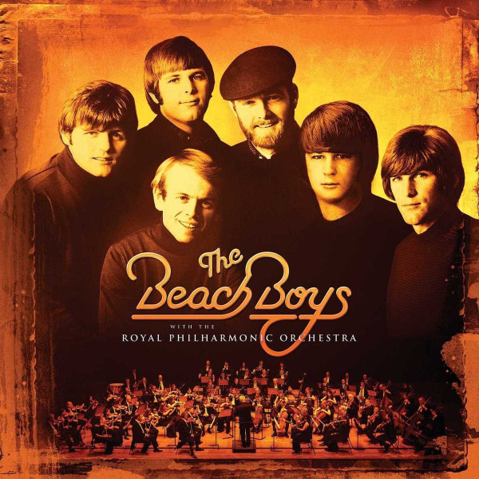

# The Beach Boys With The Royal Philharmonic Orchestra

By Royal Philharmonic Orchestra

## Album Data

- Catalog #: Roon
- Format: Digital, Album

## Track listing

1. California Suite
2. California Girls
3. Wouldn't It Be Nice
4. Fun, Fun, Fun
5. Don't Worry Baby
6. God Only Knows
7. Sloop John B
8. Heroes and Villains
9. Disney Girls
10. Here Today
11. In My Room
12. Kokomo
13. The Warmth of the Sun
14. Darlin'
15. Help Me Rhonda
16. You Still Believe in Me
17. Good Vibrations

## See also

- [A Love So Beautiful](A_Love_So_Beautiful-_Roy_Orbison_and_The_Royal_Philharmonic_Orchestra_with_The_Royal_Philharmonic_Orchestra.md)
- [Beethoven](Beethoven-_Symphony_No_7__Op_92.md)
- [Boxsets and Chill](Boxsets_and_Chill.md)
- [Carpenters With The Royal Philharmonic Orchestra](Carpenters_With_The_Royal_Philharmonic_Orchestra.md)
- [Concerto for Group and Orchestra](Concerto_for_Group_and_Orchestra.md)
- [Grieg](Grieg-_Peer_Gynt_etc.md)
- [Mahler Symphony No.4](Mahler_Symphony_No4.md)
- [Mozart](Mozart-_Concertos_For_Two_Pianos_K_242_and_365;_Kozeluch-_Four_Hands_Piano_Concerto.md)
- [Philharmania](Philharmania.md)
- [The Queen Symphony](The_Queen_Symphony.md)
