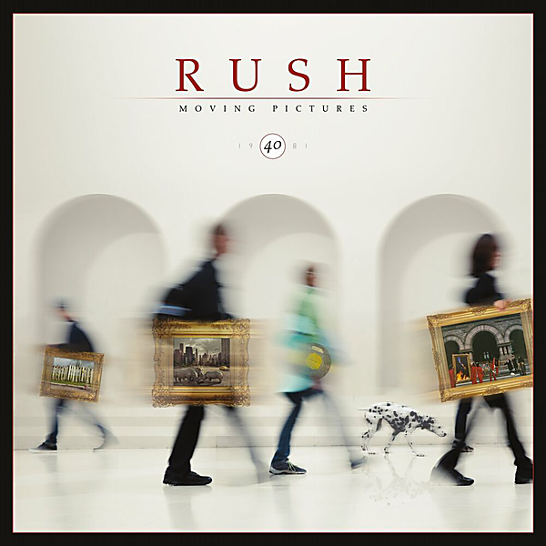

# Moving Pictures (40th Anniversary Super Deluxe)

By Rush

## Album Data

- Catalog #: Roon
- Format: Digital, Album

## Track listing

1-1 Tom Sawyer
1-2 Red Barchetta
1-3 YYZ
1-4 Limelight
1-5 The Camera Eye
1-6 Witch Hunt (Part III of "Fear")
1-7 Vital Signs
2-1 2112 - Overture (live in YYZ 1981)
2-2 2112 - The Temples of Syrinx (live in YYZ 1981)
2-3 Freewill (live in YYZ 1981)
2-4 Limelight (live in YYZ 1981)
2-5 Cygnus X-1 Book II: Hemispheres - Prelude
2-6 Beneath, Between & Behind (live in YYZ 1981)
2-7 The Camera Eye (live in YYZ 1981)
2-8 YYZ (live in YYZ 1981)
2-9 Broon's Bane (live in YYZ 1981)
2-10 The Trees (live in YYZ 1981)
2-11 Xanadu (live in YYZ 1981)
2-12 The Spirit of Radio (live in YYZ 1981)
2-13 Red Barchetta (live in YYZ 1981)
2-14 Closer to the Heart (live in YYZ 1981)
2-15 Tom Sawyer (live in YYZ 1981)
2-16 Vital Signs (live in YYZ 1981)
2-17 Natural Science (live in YYZ 1981)
2-18 Working Man/Cygnus X-1 Book II: Hemispheres - Armageddon: The Battle of Heart and Mind/By-Tor & the Snow Dog/In the End/In the Mood /2112 - Grand Finale
2-19 La Villa Strangiato (live in YYZ 1981)

