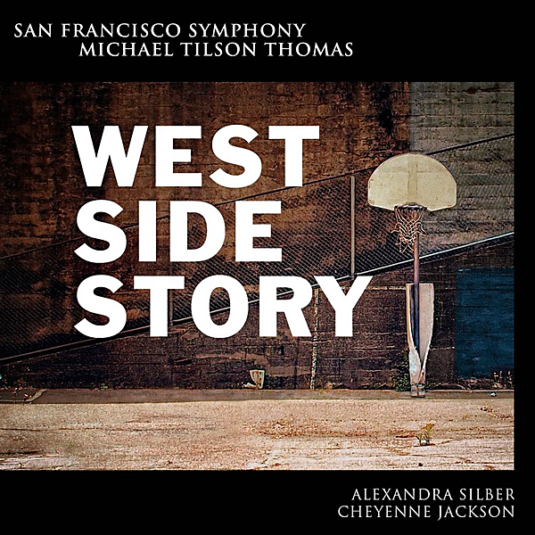

# Bernstein: West Side Story

By San Francisco Symphony

## Album Data

- Catalog #: Roon
- Format: Digital, Album

## Track listing

1. West Side Story, Act 1: Prologue
2. West Side Story, Act 1: "Jet Song" (Riff, Jets)
3. West Side Story, Act 1: "Something's coming" (Tony)
4. West Side Story, Act 1: The Dance at the Gym (Blues)
5. West Side Story, Act 1: The Dance at the Gym (Promenade)
6. West Side Story, Act 1: The Dance at the Gym (Mambo)
7. West Side Story, Act 1: The Dance at the Gym (Cha-Cha)
8. West Side Story, Act 1: The Dance at the Gym (Meeting Scene) [Tony, Maria]
9. West Side Story, Act 1: The Dance at the Gym (Jump)
10. West Side Story, Act 1: "Maria" (Tony)
11. West Side Story, Act 1: "Tonight" (Balcony Scene) [Maria, Tony]
12. West Side Story, Act 1: "Only you" (Maria, Tony)
13. West Side Story, Act 1: "America" (Anita, Rosalia, Shark Girls)
14. West Side Story, Act 1: "Cool" (Riff, Jets)
15. West Side Story, Act 1: "One hand, one heart" (Maria, Tony)
16. West Side Story, Act 1: "Tonight" (Jets, Sharks, Anita, Tony, Maria, Riff, Bernardo)
17. West Side Story, Act 1: The Rumble
18. West Side Story, Act 2: "I feel pretty" (Maria, Consuelo, Rosalia, Francisca)
19. West Side Story, Act 2: Ballet Sequence (Allegro agitato)
20. West Side Story, Act 2: Ballet Sequence (Los stesso tempo) [Tony, Maria]
21. West Side Story, Act 2: Ballet Sequence (Adagio)
22. West Side Story, Act 2: Ballet Sequence (Scherzo)
23. West Side Story, Act 2: "Somewhere" (Ballet Sequence) [Consuelo]
24. West Side Story, Act 2: Procession & Nightmare (Ballet Sequence) [Jets, Sharks]
25. West Side Story, Act 2: Adagio (Ballet Sequence) [Tony, Maria]
26. West Side Story, Act 2: "Gee, Officer Krupke" (Jets)
27. West Side Story, Act 2: "A boy like that" (Anita, Maria)
28. West Side Story, Act 2: "I have a love" (Anita, Maria)
29. West Side Story, Act 2: Change of Scene
30. West Side Story, Act 2: Jukebox (Taunting Scene)
31. West Side Story, Act 2: Finale (Maria, Tony)

