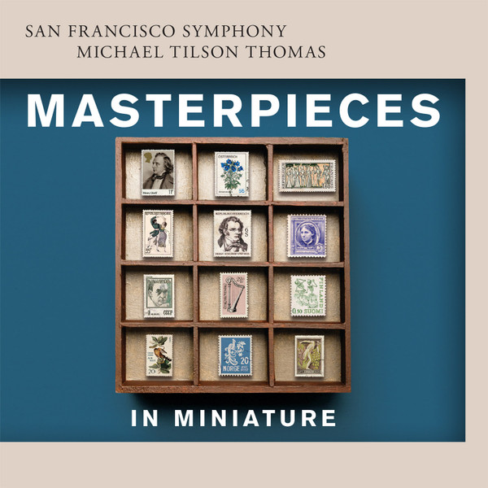

# Masterpieces in Miniature

By San Francisco Symphony

## Album Data

- Catalog #: Roon
- Format: Digital, Album

## Track listing

1. Concerto symphonique No. 4: Scherzo
2. Blumine
3. Pavane
4. La Plus que lente
5. Rosamunde: Entr'acte No. 3
6. A Concord Symphony: The Alcotts
7. Vocalise, Op. 34/14
8. Legend for orchestra, Op. 59/6
9. Valse triste
10. On Hearing the First Cuckoo in Spring
11. The Last Spring, Op. 34/2
12. Sylvia: Cortège de Bacchus

## See also

- [Bernstein](Bernstein-_West_Side_Story.md)
- [Copland](Copland-_Symphony_No_3.md)
- [Mahler](Mahler-_Symphony_No_6.md)
- [Piano Concerto No. 3 & Mass in C](Piano_Concerto_No_3_and_Mass_in_C.md)
- [Tchaikovsky](Tchaikovsky-_Symphony_No_5_and_Romeo_and_Juliet__Fantasy-Overture.md)
- [Tchaikovsky](Tchaikovsky-_Symphony_No_6__Pathétique.md)
