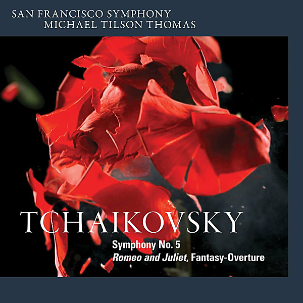

# Tchaikovsky: Symphony No. 5 & Romeo and Juliet, Fantasy-Overture

By San Francisco Symphony

## Album Data

- Catalog #: Roon
- Format: Digital, Album

## Track listing

1. Symphony No. 5 in E minor, Op. 64: 1. Andante - Allegro con anima
2. Symphony No. 5 in E minor, Op. 64: 2. Andante cantabile, con alcuna licenza
3. Symphony No. 5 in E minor, Op. 64: 3. Valse: Allegro moderato
4. Symphony No. 5 in E minor, Op. 64: 4. Finale: Andante maestoso - Allegro vivace - Moderato assai e molto maestoso - Presto - Molto meno mosso
5. Romeo and Juliet, Fantasy-Overture

## See also

- [Bernstein](Bernstein-_West_Side_Story.md)
- [Copland](Copland-_Symphony_No_3.md)
- [Mahler](Mahler-_Symphony_No_6.md)
- [Masterpieces in Miniature](Masterpieces_in_Miniature.md)
- [Piano Concerto No. 3 & Mass in C](Piano_Concerto_No_3_and_Mass_in_C.md)
- [Tchaikovsky](Tchaikovsky-_Symphony_No_6__Pathétique.md)
