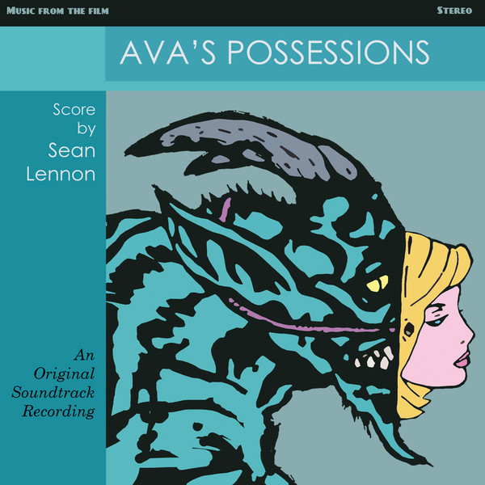

# Ava's Possessions

By Sean Lennon

## Album Data

- Catalog #: Roon
- Format: Digital, Album

## Track listing

1. Demon Daughter
2. Blame Beelzabub
3. Spirit Possession Anonymous
4. Ava's Awake
5. Naphula's Theme
6. Blood Stain Sonata
7. Different Drum
8. Abbadon the Annihilator
9. Hazel's Waltz
10. Demon Dinner
11. Lach Mich Tot (A.A, Khan, Roger Baptist)
12. Lullaby for a Murder (Mary Ochers)

## See also

- [Alter Egos (Original Motion Picture Soundtrack)](Alter_Egos_Original_Motion_Picture_Soundtrack.md)
- [Friendly Fire](Friendly_Fire.md)
- [Into The Sun](Into_The_Sun.md)
- [Mystical Weapons](Mystical_Weapons.md)
- [Rosencrantz & Guildenstern Are Undead](Rosencrantz_and_Guildenstern_Are_Undead.md)
- [Beets: Friendly Fire](../../Beets/Sean_Lennon/Friendly_Fire.md)
- [Beets: Into the Sun](../../Beets/Sean_Lennon/Into_the_Sun.md)
- [CD: Friendly Fire](../../CD/Sean_Lennon/Friendly_Fire.md)
- [CD: Into The Sun](../../CD/Sean_Lennon/Into_The_Sun.md)
- [CD: Rosencrantz And Guildenstern Are Undead](../../CD/Sean_Lennon/Rosencrantz_And_Guildenstern_Are_Undead.md)
- [CD: ](../../CD/Sean_Lennon/Sean_Lennon.md)
- [Vinyl: Alter Egos](../../Vinyl/Sean_Lennon/Alter_Egos.md)
- [Vinyl: ](../../Vinyl/Sean_Lennon/Sean_Lennon.md)
