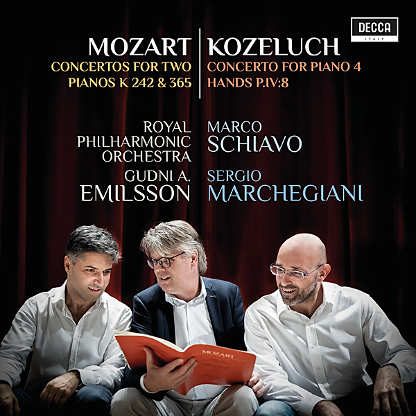

# Mozart: Concertos For Two Pianos K 242 & 365; Kozeluch: Four Hands Piano Concerto

By Sergio Marchegiani

## Album Data

- Catalog #: Roon
- Format: Digital, Album

## Track listing

1. Mozart: Piano Concerto No. 7 in F Major, K. 242 "Lodron" - I. Allegro (Arr. Mozart for 2 Pianos)
2. Mozart: Piano Concerto No. 7 in F Major, K. 242 "Lodron" - II. Adagio (Arr. Mozart for 2 Pianos)
3. Mozart: Piano Concerto No. 7 in F Major, K. 242 "Lodron" - III. Rondo. Tempo di menuetto (Arr. Mozart for 2 Pianos)
4. Mozart: Piano Concerto No. 10 in E-Flat Major, K. 365 - I. Allegro
5. Mozart: Piano Concerto No. 10 in E-Flat Major, K. 365 - II. Andante
6. Mozart: Piano Concerto No. 10 in E-Flat Major, K. 365 - III. Rondo. Allegro
7. Koželuch: Concerto for Keyboard 4 Hands, P. IV:8 - I. Allegro
8. Koželuch: Concerto for Keyboard 4 Hands, P. IV:8 - II. Adagio
9. Koželuch: Concerto for Keyboard 4 Hands, P. IV:8 - III. Rondo. Allegretto

