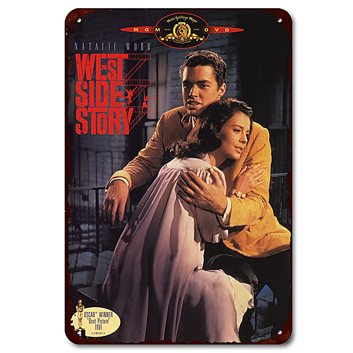

# West Side Story (The Original Soundrack Recording, 1961)

By Stephen Sondheim

## Album Data

- Catalog #: Roon
- Format: Digital, Album

## Track listing

1. Overture
2. Prologue
3. Jet Song
4. Something's Coming
5. Dance at the Gym
6. Maria
7. America
8. West Side Story, film score: Tonight
9. West Side Story, film score: Gee, Officer Krupke
10. West Side Story, film score: Intermission Music
11. West Side Story, film score: I Feel Pretty
12. West Side Story, film score: One Hand, One Heart
13. West Side Story, film score: Quintet
14. West Side Story, film score: The Rumble
15. West Side Story, film score: Somewhere
16. West Side Story, film score: Cool
17. West Side Story, film score: A Boy Like That / I Have A Love
18. West Side Story, film score: Finale
19. West Side Story, film score: End Credits

