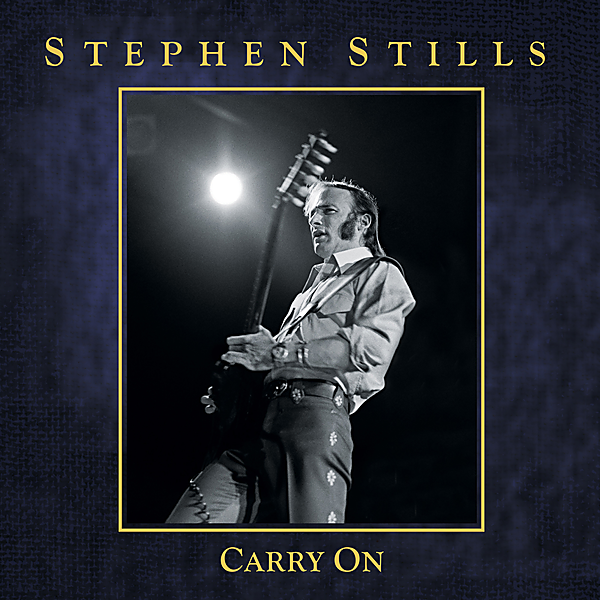

# Carry On

By Stephen Stills

## Album Data

- Catalog #: Roon
- Format: Digital, Album

## Track listing

1-1 Travelin'
1-2 High Flyin' Bird
1-3 Sit Down I Think I Love You
1-4 Go and Say Goodbye
1-5 For What It's Worth
1-6 Everydays [2013 Remix]
1-7 Pretty Girl Why
1-8 Bluebird
1-9 Rock & Roll Woman
1-10 Special Care
1-11 Questions
1-12 Uno Mundo
1-13 Four Days Gone [Demo Version]
1-14 Who Ran Away?
1-15 49 Reasons
1-16 Helplessly Hoping
1-17 You Don't Have to Cry
1-18 Suite: Judy Blue Eyes
1-19 4+20 [2013 Remix]
1-20 So Beings the Task
1-21 The Lee Shore
1-22 Carry On/Questions [Alternate Mix]
1-23 Woodstock
2-1 Love the One You're With
2-2 Old Times Good Times
2-3 Black Queen
2-4 No-Name Jam
2-5 Go Back Home
2-6 Marianne
2-7 My Love Is a Gentle Thing
2-8 Fishes and Scorpions
2-9 The Treasure
2-10 To a Flame
2-11 Cherokee
2-12 Song of Love
2-13 Rock & Roll Crazies/Cuban Bluegrass
2-14 Jet Set (Sigh)
2-15 It Doesn't Matter
2-16 Colorado
2-17 Johnny's Garden
2-18 Change Partners [New Mix]
2-19 Do for the Others
2-20 Find the Cost of Freedom [Live at Music Hall, Boston, MA, October 3, 1971]
2-21 Little Miss Bright Eyes
2-22 Isn't It About Time
3-1 Turn Back the Pages
3-2 First Things First
3-3 My Angel
3-4 Love Story
3-5 As I Come of Age
3-6 Know You Got to Run [Live at Paramount Theater, Seattle, WA, December 8, 1975]
3-7 Black Coral
3-8 I Give You Give Blind [Remix]
3-9 Crossroads/You Can't Catch Me [Live at Civic Center, Lakeland, FL, November 19, 1977]
3-10 See the Changes [Remix]
3-11 Thoroughfare Gap
3-12 Lowdown
3-13 Cuba Al Fin [Edit] [Live at Teatro Karl Marx, Havana, Cuba, March 3, 1979]
3-14 Dear Mr. Fantasy
3-15 Spanish Suite
3-16 Feel Your Love [Remix]
3-17 Raise a Voice
3-18 Daylight Again/Find the Cost of Freedom
4-1 Southern Cross
4-2 Dark Star
4-3 Turn Your Back on Love
4-4 War Games
4-5 50/50
4-6 Welfare Blues
4-7 Church (Part of Someone)
4-8 I Don't Get It
4-9 Isn't It So
4-10 Haven't We Lost Enough?
4-11 The Ballad of Hollis Brown
4-12 Treetop Flyer
4-13 Heart's Gate
4-14 Girl From the North Country [Live at Beacon Theater, New York, NY, October, 2012]
4-15 Feed the People
4-16 Panama
4-17 No Tears Left
4-18 Ole Man Trouble
4-19 Ain't It Always

