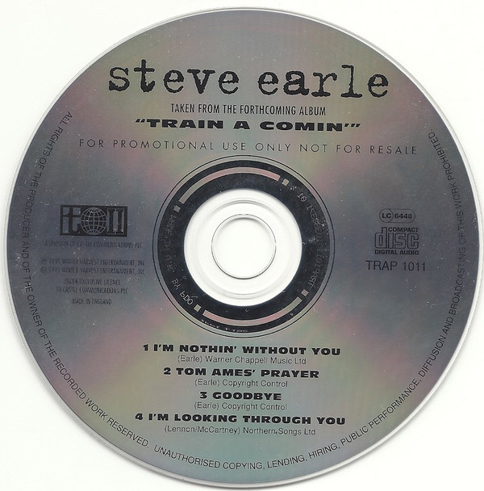

# Train A Comin'

By Steve Earle

## Album Data

- Catalog #: Roon
- Format: Digital, Album

## Track listing

1. Mystery Train Part II
2. Hometown Blues
3. Sometimes She Forgets
4. Mercenary Song
5. Goodbye
6. Tom Ames' Prayer
7. Nothin' Without You
8. Angel Is the Devil
9. I'm Looking Through You
10. Nothern Winds
11. Bem McCulloch
12. Rivers of Babylon
13. Tecumseh Valley

## See also

- [Copperhead Road](Copperhead_Road.md)
- [Beets: Copperhead Road](../../Beets/Steve_Earle/Copperhead_Road.md)
- [Beets: Guitar Town](../../Beets/Steve_Earle/Guitar_Town.md)
- [Beets: I Feel Alright](../../Beets/Steve_Earle/I_Feel_Alright.md)
- [Beets: Train a Comin’](../../Beets/Steve_Earle/Train_a_Comin’.md)
- [Beets: Trancendental Blues](../../Beets/Steve_Earle/Trancendental_Blues.md)
- [CD: Copperhead Road](../../CD/Steve_Earle/Copperhead_Road.md)
- [CD: ](../../CD/Steve_Earle/Steve_Earle.md)
