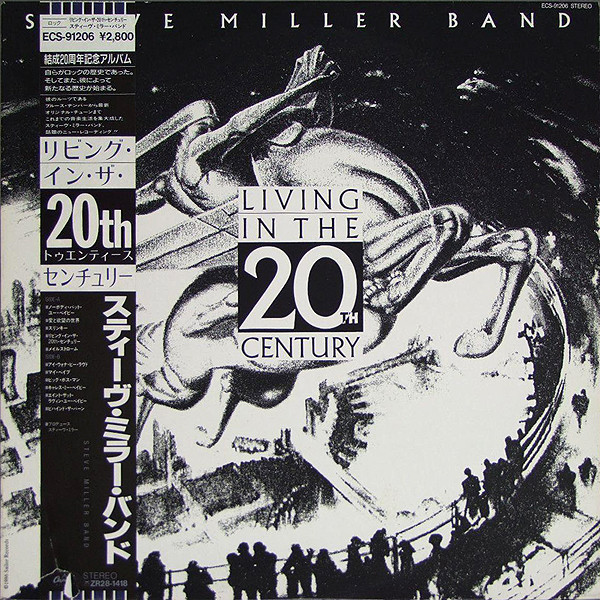

# Living In The 20th Century

By Steve Miller

## Album Data

- Catalog #: Roon
- Format: Digital, Album

## Track listing

1. Nobody But You Baby
2. I Want to Make the World Turn Around
3. Slinky
4. Living in the 20th Century
5. Maelstrom
6. I Wanna Be Loved (But by Only You)
7. My Babe
8. Big Boss Man
9. Caress Me Baby
10. Ain't That Lovin' You Baby
11. Behind the Barn

## Track listing

1. Nobody But You Baby
2. I Want to Make the World Turn Around
3. Slinky
4. Living in the 20th Century
5. Maelstrom
6. I Wanna Be Loved (But by Only You)
7. My Babe
8. Big Boss Man
9. Caress Me Baby
10. Ain't That Lovin' You Baby
11. Behind the Barn

## See also

- [Abracadabra](Abracadabra.md)
- [Bingo!](Bingo!.md)
- [Book Of Dreams](Book_Of_Dreams.md)
- [Brave New World](Brave_New_World.md)
- [Children Of The Future](Children_Of_The_Future.md)
- [Fly Like An Eagle](Fly_Like_An_Eagle.md)
- [Number 5](Number_5.md)
- [Recall The Beginning…A Journey From Eden](Recall_The_Beginning…A_Journey_From_Eden.md)
- [Sailor](Sailor.md)
- [The Joker](The_Joker.md)
- [Your Saving Grace](Your_Saving_Grace.md)
