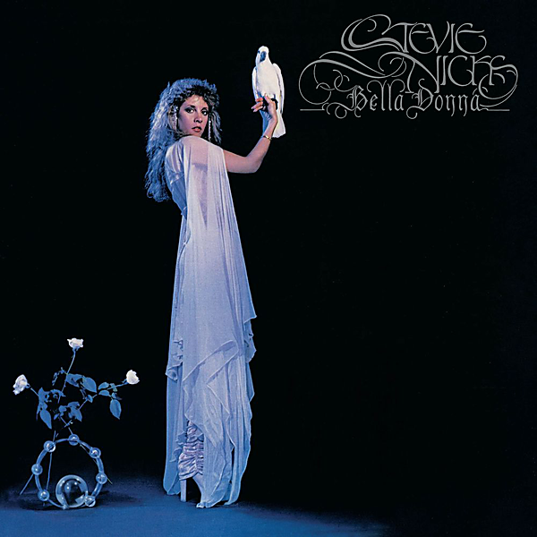

# Bella Donna (Deluxe Edition)

By Stevie Nicks

## Album Data

- Catalog #: Roon
- Format: Digital, Album

## Track listing

1-1 Bella Donna
1-2 Kind of Woman
1-3 Stop Draggin' My Heart Around (With Tom Petty & the Heartbreakers)
1-4 Think About It
1-5 After the Glitter Fades
1-6 Edge of Seventeen
1-7 How Still My Love
1-8 Leather and Lace
1-9 Outside the Rain
1-10 The Highwayman
2-1 Edge Of Seventeen [Early Take]
2-2 Think About It [Alternate Version]
2-3 How Still My Love [Alternate Version]
2-4 Leather and Lace [Alternate Version]
2-5 Bella Donna [Demo]
2-6 Gold And Braid [Unreleased Version]
2-7 Sleeping Angel [Alternate Version]
2-8 If You Were My Love [Unreleased Version]
2-9 The Dealer [Unreleased Version]
2-10 Blue Lamp [From "Heavy Metal"]
2-11 Sleeping Angel [From "Fast Times at Ridgemont High"]
3-1 Gold Dust Woman [Live 1982]
3-2 Gold and Braid [Live 1982]
3-3 I Need to Know [Live 1982]
3-4 Outside the Rain [Live 1982]
3-5 Dreams [Live 1982]
3-6 Angel [Live 1982]
3-7 After the Glitter Fades [Live 1982]
3-8 Leather and Lace [Live 1982]
3-9 Stop Draggin' My Heart Around [Live 1982]
3-10 Bella Donna [Live 1982]
3-11 Sara [Live 1982]
3-12 How Still My Love [Live]
3-13 Edge of Seventeen [Live 1982]
3-14 Rhiannon [Live 1982]

