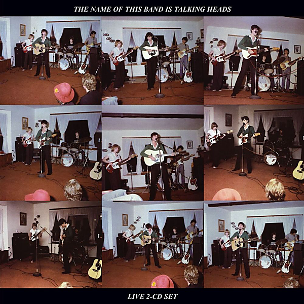

# The Name of This Band Is Talking Heads (Expanded 2004 Remaster)

By Talking Heads

## Album Data

- Catalog #: Roon
- Format: Digital, Album

## Track listing

1. New Feeling
2. A Clean Break (Let's Work)
3. Don't Worry About the Government
4. Pulled Up
5. Psycho Killer
6. Who Is It?
7. The Book I Read
8. The Big Country
9. I'm Not in Love
10. The Girls Want to Be with the Girls
11. Electricity (Drugs)
12. Found a Job
13. Mind
14. Artists Only
15. Stay Hungry [Expanded 1979 Version]
16. Air
17. Love --> Building on Fire
18. Memories Can't Wait
19. Heaven
20. Psycho Killer
21. Warning Sign
22. Stay Hungry [Expanded 1980 Version]
23. Cities
24. I Zimbra
25. Drugs
26. Once In a Lifetime
27. Animals
28. Houses In Motion
29. Born Under Punches (the Heat Goes On)
30. Crosseyed and Painless
31. Life During Wartime
32. Take Me To the River
33. The Great Curve

