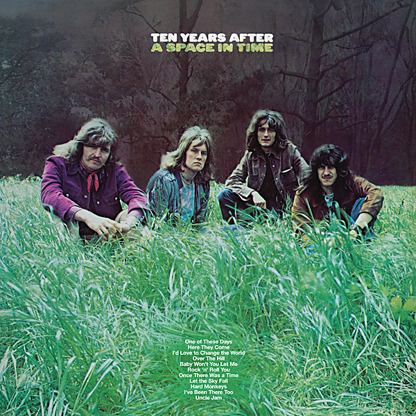

# A Space in Time (Deluxe Version)

By Ten Years After

## Album Data

- Catalog #: Roon
- Format: Digital, Album

## Track listing

1. One of These Days
2. Here They Come
3. I'd Love to Change the World
4. Over the Hill
5. Baby Won't You Let Me Rock 'N' Roll You
6. Once There Was a Time
7. Let the Sky Fall
8. Hard Monkeys
9. I've Been There Too
10. Uncle Jam
11. One of These Days [1973 Quad Mix To Stereo]
12. Here They Come [1973 Quad Mix To Stereo]
13. I'd Love to Change the World [1973 Quad Mix To Stereo]
14. Over the Hill [1973 Quad Mix To Stereo]
15. Baby Won't You Let Me Rock 'N Roll You [1973 Quad Mix To Stereo]
16. Once There Was a Time [1973 Quad Mix To Stereo]
17. Let The Sky Fall [1973 Quad Mix To Stereo]
18. Hard Monkeys [1973 Quad Mix To Stereo]
19. I've Been There Too [1973 Quad Mix To Stereo]
20. Uncle Jam [1973 Quad Mix To Stereo]

## See also

- [Cricklewood Green (2017 Remaster)](Cricklewood_Green_2017_Remaster.md)
- [Rock & Roll Music to the World (2017 Remaster)](Rock_and_Roll_Music_to_the_World_2017_Remaster.md)
- [Ten Years After (Re-Presents)](Ten_Years_After_Re-Presents.md)
- [Undead (Re-Presents / Live)](Undead_Re-Presents_-_Live.md)
- [Beets: A Space in Time](../../Beets/Ten_Years_After/A_Space_in_Time.md)
- [Beets: Cricklewood Green](../../Beets/Ten_Years_After/Cricklewood_Green.md)
- [Beets: Rock & Roll Music to the World](../../Beets/Ten_Years_After/Rock_and_Roll_Music_to_the_World.md)
- [Beets: Stonedhenge](../../Beets/Ten_Years_After/Stonedhenge.md)
- [Beets: Undead](../../Beets/Ten_Years_After/Undead.md)
- [CD: A Space In Time](../../CD/Ten_Years_After/A_Space_In_Time.md)
- [CD: ](../../CD/Ten_Years_After/Ten_Years_After.md)
- [Vinyl: Rock & Roll Music To The World](../../Vinyl/Ten_Years_After/Rock_and_Roll_Music_To_The_World.md)
- [Vinyl: ](../../Vinyl/Ten_Years_After/Ten_Years_After.md)
