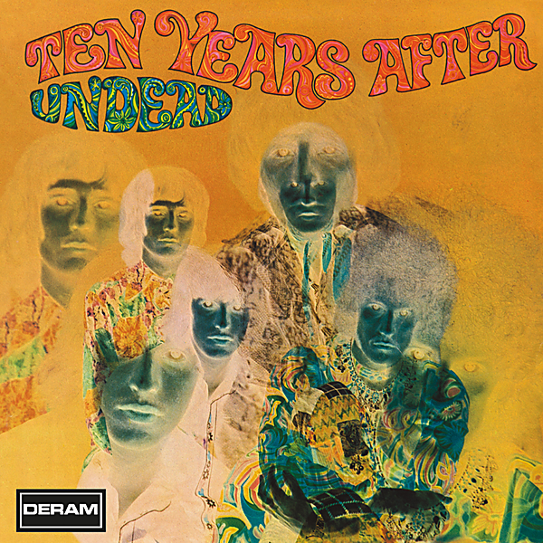

# Undead (Re-Presents / Live)

By Ten Years After

## Album Data

- Catalog #: Roon
- Format: Digital, Album

## Track listing

1-1 I May Be Wrong, But I Won't Be Wrong Always [Live "Undead" Version]
1-2 (At The) Woodchopper's Ball [Live "Undead" Version]
1-3 Spider in My Web [Live "Undead" Version]
1-4 Summertime/Shantung Cabbage [Live "Undead" Version]
1-5 I'm Going Home [Live "Undead" Version]
2-1 Rock Your Mama [Live "Undead" Version]
2-2 Spoonful [Live "Undead" Version]
2-3 Standing at the Crossroads [Live "Undead" Version]
2-4 I Can't Keep From Crying Sometimes/Extension on One Chord [Live "Undead" Version]
2-5 Woman Trouble [Live on BBC Top Gear, 1968]
2-6 (At The) Woodchopper's Ball [Live on BBC Top Gear, 1968]
2-7 No Title Blues [Live on BBC Top Gear, 1968]
2-8 I'm Going Home [Live on BBC Top Gear, 1968]
2-9 Hear Me Calling [Live on BBC David Symonds Show, 1968]
2-10 Woman Trouble [Live on BBC David Symonds Show, 1968]
2-11 Standing at the Crossroads [Live on BBC Top Gear, 1968]

