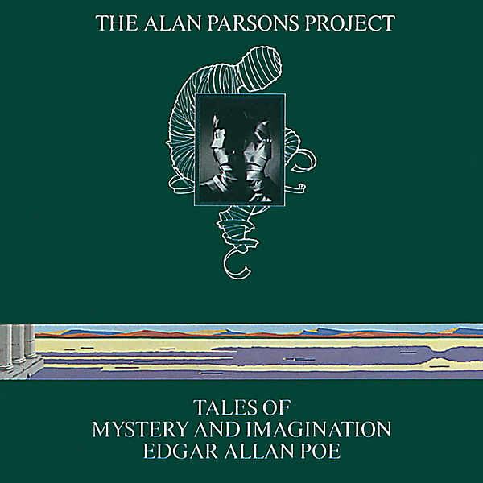

# Tales Of Mystery And Imagination - Edgar Allan Poe (1987 Remix)

By The Alan Parsons Project

## Album Data

- Catalog #: Roon
- Format: Digital, Album

## Track listing

1. A Dream Within a Dream
2. The Raven
3. The Tell-Tale Heart
4. The Cask of Amontillado
5. (The System of) Doctor Tarr and Professor Fether
6. The Fall of the House of Usher: Prelude
7. The Fall of the House of Usher: Arrival
8. The Fall of the House of Usher: Intermezzo
9. The Fall of the House of Usher: Pavane
10. The Fall of the House of Usher: Fall
11. To One in Paradise

