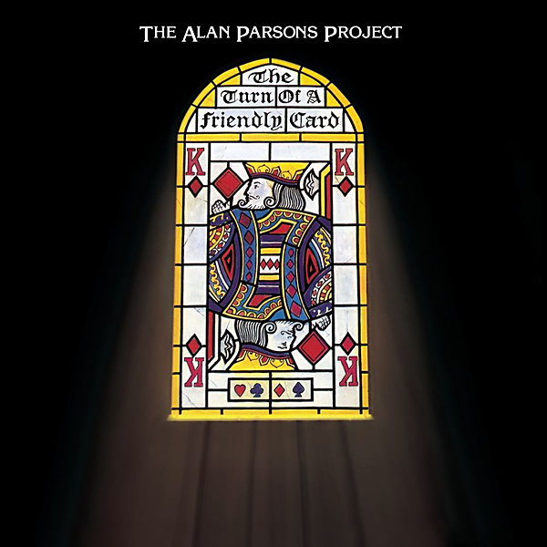

# The Turn Of A Friendly Card (Expanded Edition)

By The Alan Parsons Project

## Album Data

- Catalog #: Roon
- Format: Digital, Album

## Track listing

1. May Be a Price to Pay
2. Games People Play
3. Time
4. I Don't Wanna Go Home
5. The Gold Bug
6. The Turn of a Friendly Card: The Turn of a Friendly Card, Pt. 1
7. The Turn of a Friendly Card: Snake Eyes
8. The Turn of a Friendly Card: The Ace of Swords
9. The Turn of a Friendly Card: Nothing Left to Lose
10. The Turn of a Friendly Card: The Turn of a Friendly Card, Pt. 2
11. May be a Price to Pay [Intro/Demo]
12. Nothing Left to Lose [Basic Backing Track]
13. Nothing Left to Lose [Chris Rainbow Overdub Vocal Compilation]
14. Nothing Left to Lose [Early Studio Version with Eric's Guide Vocal]
15. Time [Early Studio Attempt]
16. Games People Play [Rough Mix]
17. The Gold Bug [Demo]

