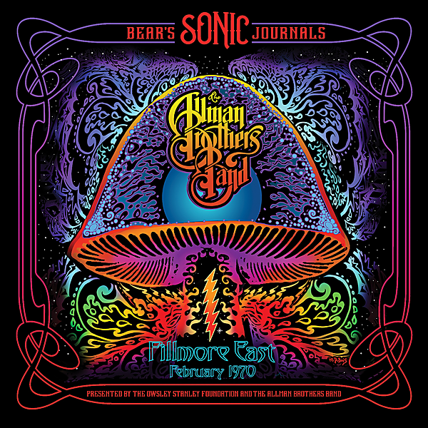

# Bear's Sonic Journals: Fillmore East February 1970 (Live)

By The Allman Brothers Band

## Album Data

- Catalog #: Roon
- Format: Digital, Album

## Track listing

1. In Memory of Elizabeth Reed
2. (I'm Your) Hoochie Coochie Man
3. Statesboro Blues
4. Trouble No More
5. Outskirts of Town
6. Whipping Post
7. Mountain Jam

## See also

- [At Fillmore East](At_Fillmore_East.md)
- [Eat A Peach](Eat_A_Peach.md)
- [The Allman Brothers Band (Remastered)](The_Allman_Brothers_Band_Remastered.md)
- [Beets: At Fillmore East](../../Beets/The_Allman_Brothers_Band/At_Fillmore_East.md)
- [Beets: Eat A Peach](../../Beets/The_Allman_Brothers_Band/Eat_A_Peach.md)
- [Vinyl: Eat A Peach](../../Vinyl/The_Allman_Brothers_Band/Eat_A_Peach.md)
- [Vinyl: ](../../Vinyl/The_Allman_Brothers_Band/The_Allman_Brothers_Band.md)
