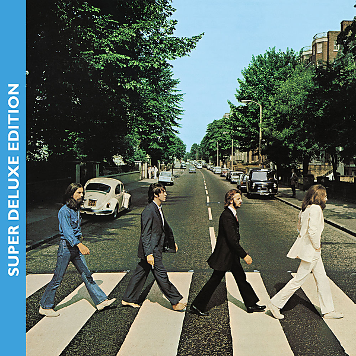

# Abbey Road (Super Deluxe Edition)

By The Beatles

## Album Data

- Catalog #: Roon
- Format: Digital, Album

## Track listing

1-1 Come Together (2019 mix)
1-2 Something (2019 mix)
1-3 Maxwell's Silver Hammer (2019 mix)
1-4 Oh! Darling (2019 mix)
1-5 Octopus's Garden (2019 mix)
1-6 I Want You (She's So Heavy) (2019 mix)
1-7 Here Comes the Sun (2019 mix)
1-8 Because (2019 mix)
1-9 You Never Give Me Your Money (2019 mix)
1-10 Sun King (2019 mix)
1-11 Mean Mr. Mustard
1-12 Polythene Pam (2019 mix)
1-13 She Came In Through the Bathroom Window (2019 mix)
1-14 Golden Slumbers (2019 mix)
1-15 Carry That Weight (2019 mix)
1-16 The End (2019 mix)
1-17 Her Majesty (2019 mix)
2-1 I Want You (She's So Heavy) [Trident Recording Session & Reduction Mix]
2-2 Goodbye [Home Demo]
2-3 Something [Studio Demo]
2-4 The Ballad of John and Yoko [Take 7]
2-5 Old Brown Shoe [Take 2]
2-6 Oh! Darling [Take 4]
2-7 Octopus's Garden [Take 9]
2-8 You Never Give Me Your Money [Take 36]
2-9 Her Majesty [Takes 1-3]
2-10 Medley: Golden Slumbers/Carry That Weight [Takes 1–3]
2-11 Here Comes the Sun [Take 9]
2-12 Maxwell's Silver Hammer [Take 12]
3-1 Come Together [Take 5]
3-2 The End [Take 3]
3-3 Come and Get It [Studio Demo]
3-4 Sun King [Take 20]
3-5 Mean Mr. Mustard [Take 20]
3-6 Polythene Pam [Take 27]
3-7 She Came in Through the Bathroom Window [Take 27]
3-8 Because [Take 1] [Instrumental]
3-9 Medley: The Long One/You Never Give Me Your Money/Sun King/Mean Mr. Mustard/Her Majesty/Polythene Pam/She Came in Through the Bathroom Window [Trial Edit & Mix] [30 July 1969]
3-10 Something [Take 39] [Instrumental] [Strings Only]
3-11 Medley: Golden Slumbers/Carry That Weight [Take 17] [Instrumental] [Strings & Brass Only]

