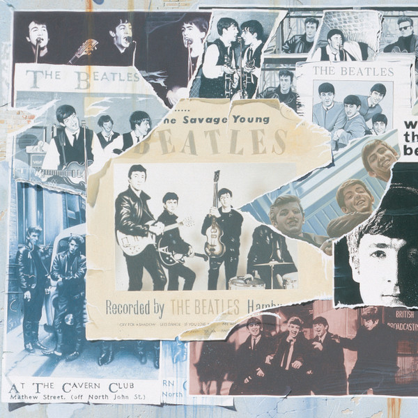

# Anthology 1

By The Beatles

## Album Data

- Catalog #: Roon
- Format: Digital, Album

## Track listing

1-1 Free as a Bird
1-2 We Were Four Guys... That's All
1-3 That'll Be the Day
1-4 In Spite of All the Danger
1-5 Sometimes I'd Borrow...Those Still Exist
1-6 Hallelujah I Love Her So
1-7 You'll Be Mine (home demo)
1-8 Cayenne
1-9 First of All... It Didn't Do a Thing Here
1-10 My Bonnie
1-11 Ain't She Sweet
1-12 Cry for a Shadow
1-13 Brian Was a Beautiful Guy...He Presented Us Well
1-14 I Secured Them... a Beatle Drink Even Then
1-15 Searchin' (Decca audition)
1-16 Three Cool Cats (Decca audition)
1-17 The Sheik of Araby (Decca audition)
1-18 Like Dreamers Do (Decca audition)
1-19 Hello Little Girl (Decca audition)
1-20 Well, the Recording Test... By My Artists
1-21 Besame Mucho
1-22 Love Me Do (slow version)
1-23 How Do You Do It?
1-24 Please Please Me (no harmonica version)
1-25 One After 909 (false starts) (takes 3, 4 & 5)
1-26 One After 909 (complete) (takes 4 & 5)
1-27 Lend Me Your Comb (live at the BBC)
1-28 I'll Get You (live on Sunday Night at the London Palladium)
1-29 We Were Performers... in Britain
1-30 I Saw Her Standing There (live for The Beatles, pop group from Liverpool visiting Stockholm)
1-31 From Me to You (live for The Beatles, pop group from Liverpool visiting Stockholm)
1-32 Money (That's What I Want) (live for The Beatles, pop group from Liverpool visiting Stockholm)
1-33 You Really Got a Hold on Me (live for The Beatles, pop group from Liverpool visiting Stockholm)
1-34 Roll Over Beethoven (live for The Beatles, pop group from Liverpool visiting Stockholm)
2-1 She Loves You (live at the Prince of Wales Theatre, London, 1963)
2-2 Till There Was You (live at the Prince of Wales Theatre, London, 1963)
2-3 Twist and Shout (live at the Prince of Wales Theatre, London, 1963)
2-4 This Boy (live on Two of a Kind)
2-5 I Want to Hold Your Hand (live on Two of a Kind)
2-6 Speech: Eric Morecambe and Ernie Wise
2-7 Moonlight Bay (live on Two of a Kind)
2-8 Can't Buy Me Love (takes 1 & 2)
2-9 All My Loving (live on the Ed Sullivan Show)
2-10 You Can't Do That (take 6)
2-11 And I Love Her (take 2)
2-12 A Hard Day's Night (take 1)
2-13 I Wanna Be Your Man (live for Around The Beatles)
2-14 Long Tall Sally (live for Around The Beatles)
2-15 Boys (live for Around The Beatles)
2-16 Shout (live for Around The Beatles)
2-17 I'll Be Back (take 2)
2-18 I'll Be Back (take 3)
2-19 You Know What to Do (demo)
2-20 No Reply (demo)
2-21 Mr. Moonlight (takes 1 & 4)
2-22 Leave My Kitten Alone (take 5)
2-23 No Reply (take 2)
2-24 Eight Days a Week (sequence)
2-25 Eight Days a Week (complete)
2-26 Kansas City/Hey-Hey-Hey-Hey!

